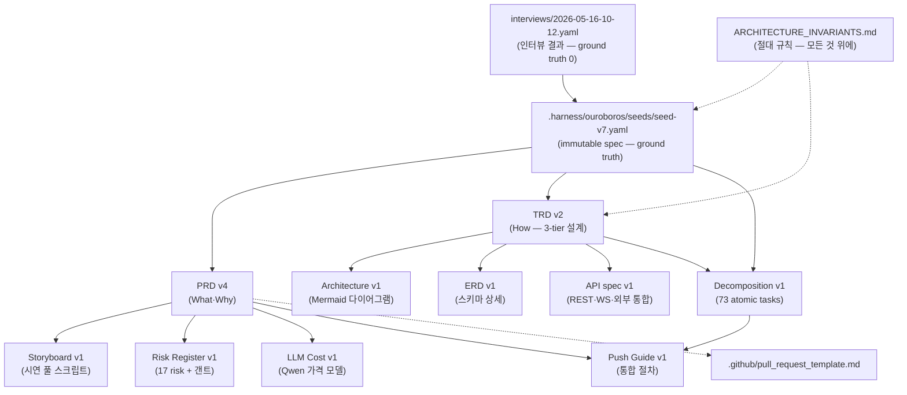

# RegTrack — Documents Catalog

> repo의 모든 분석/설계 문서·spec을 한눈에 보는 안내문.
> **처음 보는 팀원·어드바이저는 이 문서부터 읽어주세요.**

| 항목 | 내용 |
|------|------|
| **프로젝트** | RegTrack — 지능형 규제 변화 모니터링 시스템 |
| **팀** | AIMBA ABP 4팀 (김지효 PM·이득규·백정헌·조민희) |
| **기간** | 12주 (2026-05 ~ 2026-08) |
| **catalog 버전** | v1 (2026-05-16) |

---

## 0. 빠른 시작 — 역할별 추천 읽기 순서

| 누구 | 처음 읽을 것 | 그 다음 |
|------|-------------|--------|
| **PM** (김지효) | `prd/PRD-RegTrack-2026-05-16.md` → `risk/RISK-RegTrack-2026-05-16.md` | `.harness/ouroboros/seeds/seed-v7.yaml` |
| **어드바이저** | `prd/PRD-RegTrack-2026-05-16.md` §1~§9 | `risk/RISK-RegTrack-2026-05-16.md` |
| **개발자** | `trd/TRD-RegTrack-2026-05-16.md` → `data-model/ERD-RegTrack-2026-05-16.md` → `api/API-RegTrack-2026-05-16.md` | `.harness/ouroboros/tasks/decomposition-2026-05-16.yaml` |
| **QA** (백정헌) | `prd/PRD-RegTrack-2026-05-16.md` §8 (AC) → `demo-scenario/STORYBOARD-RegTrack-2026-05-16.md` | `.harness/ouroboros/tasks/decomposition-2026-05-16.yaml` test 필드 |
| **시연 발표자** | `demo-scenario/STORYBOARD-RegTrack-2026-05-16.md` | `architecture/ARCHITECTURE-RegTrack-2026-05-16.md` 시퀀스 |
| **신규 합류자** | 본 문서 → 위 모두 | - |

---

## 1. 문서 카탈로그 (모두 9개 + spec 1개)

### 📁 `docs/prd/` — Product Requirements
| 파일 | 역할 | 누가 봐야 | 분량 |
|------|------|----------|------|
| `PRD-RegTrack-2026-05-16.md` (v4) | **무엇을·왜** 만드는지의 ground truth. AC·페르소나·시연 시나리오·Risk·Scope Governance §17 | 모두 (특히 PM·어드바이저) | ~500줄 |

### 📁 `docs/trd/` — Technical Reference
| 파일 | 역할 | 누가 봐야 | 분량 |
|------|------|----------|------|
| `TRD-RegTrack-2026-05-16.md` (v2) | **어떻게** 구현하는지 3-tier 기술 설계서. 핵심 결정 D-1~D-9, 비즈니스 규칙 BR-1~BR-3, 12주 구현 순서 T-1~T-29 sketch | 개발자 전원 | ~700줄 |

### 📁 `docs/architecture/` — Diagrams
| 파일 | 역할 | 누가 봐야 | 분량 |
|------|------|----------|------|
| `ARCHITECTURE-RegTrack-2026-05-16.md` | Mermaid C4 모델(Context·Container·Component) + 7개 시퀀스 다이어그램 + Deployment + Layer Dependency 게이트 | 개발자·어드바이저 | ~500줄 |

### 📁 `docs/data-model/` — Schema
| 파일 | 역할 | 누가 봐야 | 분량 |
|------|------|----------|------|
| `ERD-RegTrack-2026-05-16.md` | SQLite 18 테이블 DDL + Obsidian frontmatter 스키마 + BM25 인덱스 + Alembic 마이그레이션 + SQL 예시 | 개발자 (특히 데이터 담당) | ~750줄 |

### 📁 `docs/api/` — Interface Spec
| 파일 | 역할 | 누가 봐야 | 분량 |
|------|------|----------|------|
| `API-RegTrack-2026-05-16.md` | REST 24개 endpoint + WebSocket 2개 채널 + Obsidian Local REST API 통합 + OpenRouter+Qwen 통합 + OpenAPI 자동 생성 | 개발자 (FE·BE 양쪽) | ~600줄 |

### 📁 `docs/demo-scenario/` — Storyboard
| 파일 | 역할 | 누가 봐야 | 분량 |
|------|------|----------|------|
| `STORYBOARD-RegTrack-2026-05-16.md` | 시연 5분 + 보너스 30초 풀 스크립트 (Frame별 NPC 대사·UI 트랜지션·사운드 큐·LLM 위젯 변화·백업 시나리오·리허설 체크리스트) | 발표자·QA | ~450줄 |

### 📁 `docs/risk/` — Risk Register
| 파일 | 역할 | 누가 봐야 | 분량 |
|------|------|----------|------|
| `RISK-RegTrack-2026-05-16.md` | 17개 risk + 12주 마일스톤 갠트(Mermaid) + Risk-Milestone 매트릭스 + 양보 우선순위 + Decision Triggers + Retro Cadence | PM·어드바이저·전원 | ~450줄 |

### 📁 `docs/llm-cost/` — Cost Model
| 파일 | 역할 | 누가 봐야 | 분량 |
|------|------|----------|------|
| `LLM-COST-RegTrack-2026-05-16.md` | OpenRouter + qwen/qwen3.6-35b-a3b 가격 + 호출 시나리오별 비용 + 12주 누적 시뮬레이션 ($1.20 예상) + 캐싱 전략 + 단계별 임계치 + 모델 선택 매트릭스 + 예산 가드 | 개발자·PM | ~400줄 |

### 📁 `docs/integration/` — Push Guide
| 파일 | 역할 | 누가 봐야 | 분량 |
|------|------|----------|------|
| `PUSH-GUIDE-RegTrack-2026-05-16.md` | base repo push + PR 생성 단계별 명령어 + 권한 설정 + 충돌 대응 + FAQ | 이득규 (push 담당) | ~400줄 |

### 📁 `.harness/ouroboros/` — Immutable Spec
| 파일 | 역할 | 누가 봐야 |
|------|------|----------|
| `interviews/2026-05-16-10-12.yaml` | 인터뷰 결과 (ambiguity 0.08, 합격) — 모든 결정의 출발점 | 전원 (참고) |
| `seeds/seed-v1.yaml` ~ `seed-v7.yaml` | **immutable 명세** (변경 시 새 버전 발행). 각 버전 changelog 명시. **seed-v7이 현재 최신** | PM·개발자 (현 상태는 v7만 보면 됨) |
| `tasks/decomposition-2026-05-16.yaml` | 73 atomic tasks (T-001~T-073) + 10 phases + AC coverage + Pair Mode 9개 | 개발자 (작업 배분) |
| `templates/seed-spec*.yaml` | seed 작성 템플릿 | (참고만) |

### 📁 기타
| 파일 | 역할 |
|------|------|
| `CLAUDE.md` | AI 협업 규칙 (3-tier·Karpathy 4원칙·Ouroboros 워크플로우) — repo 작업 시 AI가 따르는 가이드 |
| `ARCHITECTURE_INVARIANTS.md` | **절대 변경 금지 4대 규칙** — 모든 결정의 최상위 우선 |
| `.github/pull_request_template.md` | PR 제출 시 자동 양식 (Scope Governance §17.2) |
| `.gitignore` | vault/, .env.local, Project Charter, .DS_Store 등 제외 |

---

## 2. 문서 의존 관계



**규칙**: 화살표는 의존성 (위→아래). seed-v7이 변경되면 모든 후속 문서 갱신 필요 (drift 방지 — PRD §17.4).

---

## 3. 변경 책임 매트릭스 (RACI 약식)

| 영역 | 변경 책임 | 리뷰 | 알림 |
|------|----------|------|------|
| `seed-v*.yaml` (immutable) | PM | 어드바이저 (대형) / 팀 (중형) | 전원 |
| PRD | PM + 작업자 | 어드바이저 | 전원 |
| TRD | 개발자 (영역별) | 다른 개발자 | PM |
| ERD | 데이터 담당 (이득규) | 개발자 | PM |
| API spec | 백엔드 담당 | 프론트 담당 | 데이터 담당 |
| Storyboard | 발표자 | QA·PM | 어드바이저 (M4 이후) |
| Risk Register | PM | 전원 | 어드바이저 |
| LLM Cost | 이득규 | PM | - |
| Push Guide | 이득규 (자율) | - | - |
| Decomposition | 팀 합의 (retro) | - | - |

---

## 4. Scope Governance 요약 (PRD §17)

진행 중 변경 발생 시:

```
크기        | 결정자       | 절차                  | seed 영향
─────────── | ──────────── | ──────────────────── | ─────────
소형        | 작업자 1인   | git commit 메시지     | 없음
중형        | 팀 합의      | 주간 retro (금요일)   | 없음
대형        | 어드바이저   | retro→advisor→seed-vN| seed 새 버전
```

**주간 retro**: 매주 금요일 30분. agenda = scope 변경 + 진척 + 다음 주.

---

## 5. 자주 묻는 질문

### Q1. "seed가 v1부터 v7까지 너무 많은데 어느 걸 보면 되나요?"
→ **seed-v7만** 보면 됨. 모든 누적 결정이 v7에 들어있음. v1~v6는 history 기록용.

### Q2. "내가 어디부터 작업해야 하는지 모르겠어요"
→ `.harness/ouroboros/tasks/decomposition-2026-05-16.yaml`의 **Phase 1 (W3)** tasks 확인. 본인 layer/skill에 해당하는 T-XXX를 PM과 협의해 할당.

### Q3. "Obsidian skill은 내가 만든 건데 우리 문서에 안 들어있나요?"
→ 들어있음. seed-v5의 D-8 결정으로 채택됨. API spec §4에 ObsidianApiClient 상세 명시. ERD §3에 frontmatter 규칙 명시. 본인 작업물(`nanobot/nanobot/skills/obsidian/SKILL.md`)이 명세의 핵심 reference.

### Q4. "LLM은 OpenAI인가요?"
→ **아니오, OpenRouter + Qwen** (`qwen/qwen3.6-35b-a3b`). 가격 $0.15/$1.00 per 1M tokens. 자세한 건 LLM Cost 문서 §1.

### Q5. "시연 환경이 Windows VM인가요 Mac인가요?"
→ **보류 (Risk R-11)**. 다음 retro 1순위 안건. 결정 후 seed-v8 발급 예정.

### Q6. "문서가 너무 많아서 본인이 다 안 봐도 되는데, 최소 필수는?"
→ **PRD §3 Goals + §9 Storyboard + Risk Register §2 High/Critical risks**. 30분 안에 다 읽을 수 있음.

---

## 6. References

- **Repo**: https://github.com/jhkim43/reg-detection (`dev` 브랜치)
- **AI 협업 규칙**: `CLAUDE.md`
- **절대 규칙**: `ARCHITECTURE_INVARIANTS.md`
- **현재 PR 절차**: `docs/integration/PUSH-GUIDE-RegTrack-2026-05-16.md`
- **카카오톡 공유용 짧은 안내**: `docs/integration/SHARE-CARD-2026-05-16.md`
