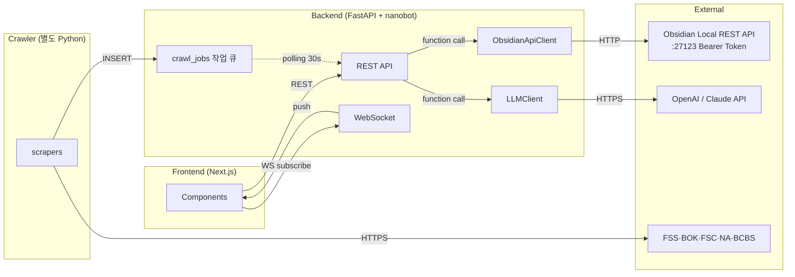

# API & Interface Spec — RegTrack

> RegTrack 백엔드의 모든 인터페이스 정의 + 외부 통합 (Obsidian REST API + LLM API).
> seed-v5 + TRD v2(예정 v3) 기반. OpenAPI 자동 생성 정책(D-5)에 따라 본 문서는 사람이 보는 명세 + 일부 예시.
> 한국어 주 + 영어 기술 용어 병기.

| 항목 | 내용 |
|------|------|
| **버전** | v1 |
| **작성일** | 2026-05-16 |
| **출처** | seed-v5 · TRD v2 · 팀원 skills/obsidian/SKILL.md |
| **REST 베이스 URL** | `http://localhost:8000` (시연 기본) |
| **WebSocket 베이스 URL** | `ws://localhost:8000` |
| **OpenAPI 자동 export** | `GET /openapi.json` (FastAPI 기본) |
| **타입 동기화 (D-5)** | `openapi-typescript` CLI → `frontend/lib/api/generated/openapi.d.ts` |

---

## 목차

- [1. 인터페이스 전체 지도](#1-인터페이스-전체-지도)
- [2. REST 엔드포인트](#2-rest-엔드포인트)
  - [2.1 Regulations](#21-regulations)
  - [2.2 Impact Analysis](#22-impact-analysis)
  - [2.3 Meeting](#23-meeting)
  - [2.4 Avatar / UserCharacter](#24-avatar--usercharacter)
  - [2.5 Dashboard Filter](#25-dashboard-filter)
  - [2.6 LLM Usage](#26-llm-usage)
  - [2.7 Agents](#27-agents)
  - [2.8 Health & Meta](#28-health--meta)
- [3. WebSocket 채널](#3-websocket-채널)
- [4. 외부 통합 — Obsidian Local REST API](#4-외부-통합--obsidian-local-rest-api)
- [5. 외부 통합 — LLM API (OpenAI / Claude)](#5-외부-통합--llm-api-openai--claude)
- [6. nanobot MCP Tool 통합](#6-nanobot-mcp-tool-통합)
- [7. 공통 규약 (에러·페이지네이션·인증·캐싱)](#7-공통-규약-에러페이지네이션인증캐싱)
- [8. OpenAPI 자동 생성 워크플로우 (D-5)](#8-openapi-자동-생성-워크플로우-d-5)
- [9. Open Issues](#9-open-issues)

---

## 1. 인터페이스 전체 지도



### 1.1 인터페이스 카테고리 8개

| # | 영역 | 채널 | 책임 |
|---|------|------|------|
| 1 | Frontend ↔ Backend (REST) | HTTP/JSON | CRUD + 액션 트리거 |
| 2 | Frontend ↔ Backend (WS) | WebSocket | NPCReport + LlmUsageSnapshot push |
| 3 | Backend ↔ Obsidian | Obsidian Local REST API (HTTP) | vault markdown CRUD + 검색 |
| 4 | Backend ↔ LLM | OpenAI/Claude SDK | 영향도 분석·디지스트·diff_summary |
| 5 | Crawler ↔ Backend | 공유 SQLite | crawl_jobs 작업 큐 (D-2) |
| 6 | Crawler ↔ 외부 사이트 | HTTPS scraping | scrapy/playwright + Flexible Parser |
| 7 | Backend 내부 (nanobot) | Python function | Agent·Service·Repository |
| 8 | Obsidian ↔ Git remote | git push (사용자 수동) | Obsidian Git plugin |

---

## 2. REST 엔드포인트

> 모든 응답은 JSON. 한글 본문은 UTF-8. 모든 timestamp는 ISO 8601 (UTC).
> 모든 endpoint는 FastAPI Router로 구현되며 OpenAPI에 자동 export.

### 2.1 Regulations

#### `GET /api/regulations`
필터 조건에 맞는 Regulation 목록 조회 (대시보드 카드·타임라인).

| 파라미터 | 위치 | 타입 | 필수 | 설명 |
|---------|------|------|------|------|
| `source_codes` | query | `string[]` | ❌ | `FSS,BOK,...` (CSV) |
| `change_types` | query | `string[]` | ❌ | `NEW,AMENDED` |
| `target_departments` | query | `string[]` | ❌ | `리테일,IB,...` |
| `date_from` | query | `date` | ❌ | ISO 8601 (YYYY-MM-DD) |
| `date_to` | query | `date` | ❌ | YYYY-MM-DD |
| `limit` | query | `int` | ❌ | default 50, max 200 |
| `offset` | query | `int` | ❌ | default 0 |

**Response 200 — `RegulationListResponseDTO`**:
```json
{
  "items": [
    {
      "id": "7c3a-...",
      "source_code": "FSS",
      "title": "전자금융감독규정 일부개정",
      "board_type": "규정",
      "change_type": "AMENDED",
      "published_at": "2026-05-15T09:00:00Z",
      "detected_at": "2026-05-15T09:32:11Z",
      "source_url": "https://fss.or.kr/...",
      "vault_path": "FSS/규정/2026/05/15-FSS-2026-05-15-001.md",
      "severity": "HIGH",
      "target_departments": ["리테일"]
    }
  ],
  "total": 23,
  "limit": 50,
  "offset": 0
}
```

> **연결 AC**: AC-004 (필터 4종)

---

#### `GET /api/regulations/{id}`
단건 조회 (raw_text 포함).

**Response 200 — `RegulationDTO`**:
```json
{
  "id": "7c3a-...",
  "source": {"code": "FSS", "name_ko": "금융감독원"},
  "external_id": "FSS-2026-05-15-001",
  "title": "...",
  "board_type": "규정",
  "change_type": "AMENDED",
  "published_at": "2026-05-15T09:00:00Z",
  "detected_at": "2026-05-15T09:32:11Z",
  "source_url": "https://...",
  "vault_path": "FSS/...",
  "raw_text": "본문 전체...",
  "versions": [
    {"version_no": 1, "captured_at": "2026-04-10T...", "diff_summary": null},
    {"version_no": 2, "captured_at": "2026-05-15T...", "diff_summary": "제5조 추가, ..."}
  ]
}
```

**Error 404**: 존재하지 않음.

---

### 2.2 Impact Analysis

#### `POST /api/impact/ask` (BR-1 Citation 강제)
사용자 캐릭터가 분석 NPC에게 자연어로 질문.

**Request — `ImpactAskRequestDTO`**:
```json
{
  "regulation_id": "7c3a-...",
  "target_department": "리테일"
}
```

**Response 200 — `ImpactAnalysisDTO`**:
```json
{
  "id": "9b2f-...",
  "regulation_id": "7c3a-...",
  "target_department": "리테일",
  "severity": "HIGH",
  "summary": "리테일 부서의 비대면 본인확인 절차를 ...",
  "llm_model": "gpt-4o-mini",
  "token_usage": 1430,
  "citations": [
    {
      "id": "c-001",
      "quoted_text": "제5조 ②항에 따라 ...",
      "char_offset_start": 1234,
      "char_offset_end": 1298,
      "relevance_score": 0.87
    }
  ],
  "created_at": "2026-05-15T10:42:00Z"
}
```

**Error 400 `InsufficientEvidenceError`**: BM25 hits=0 → 분석 거부.
**Error 422 `CitationMissingError`**: LLM 응답에 Citation 0개 → BR-1 위반.
**Error 504 `LLMTimeoutError`**: LLM API 30초 초과.

> **연결 AC**: AC-003 (Citation 강제), AC-005 Frame 3-4

---

#### `GET /api/impact/{id}` — 조회
**Response 200**: 위와 동일.

---

### 2.3 Meeting

#### `GET /api/meeting/current`
현재 또는 다음 SCHEDULED MeetingSession 1건 조회.

**Response 200 — `MeetingSessionDTO`** (200) 또는 `null` (없음):
```json
{
  "id": "m-001",
  "scheduled_for": "2026-05-22T17:00:00+09:00",
  "status": "SCHEDULED",
  "room_scene_id": "compliance-meeting-room",
  "digest_window_start": "2026-05-15T00:00:00Z",
  "digest_window_end": "2026-05-22T00:00:00Z",
  "participants": [
    {"type": "AGENT", "agent_id": "a-crawler-fss", "seat_position": "2,3", "speaking_order": 1},
    {"type": "AGENT", "agent_id": "a-analyzer", "seat_position": "4,3", "speaking_order": 2},
    {"type": "USER", "user_character_id": "u-001", "seat_position": "3,5", "speaking_order": null}
  ]
}
```

---

#### `POST /api/meeting/{id}/conduct` (BR-3 4항목 강제)
회의 진행 — 디지스트 생성 + MeetingReport 발행 + NPCReport push.

**Request**: body 없음.

**Response 200 — `MeetingReportDTO`**:
```json
{
  "id": "mr-001",
  "meeting_session_id": "m-001",
  "new_regulation_count": 7,
  "high_severity_count": 2,
  "top_regulation_id": "7c3a-...",
  "top_citation_id": "c-001",
  "next_week_recommendation": "다음 주는 FSS 보도자료에서 비대면 본인확인 관련 후속 조치 모니터링 권고",
  "digest_text": "이번 주 신규 7건, HIGH 영향 2건이 발견되었습니다. 가장 중요한 건은 '전자금융감독규정 일부개정'이며 제5조 ②항에서 ...",
  "llm_model": "gpt-4o-mini",
  "token_usage": 2814,
  "created_at": "2026-05-22T17:01:23Z"
}
```

**Error 422 `EmptyWindowError`**: digest_window에 데이터 없음.

> **연결 AC**: AC-011, **BR-3 검증** (a/b/c/d 필드 모두 NOT NULL)

---

### 2.4 Avatar / UserCharacter

#### `GET /api/user-characters/me`
현재 사용자 (시연용 1인) 조회.

**Response 200 — `UserCharacterDTO`**:
```json
{
  "id": "u-001",
  "display_name": "이지영 대리",
  "department": "리테일",
  "sprite_asset_id": "player-default",
  "lpc_parts": {
    "head": "head_01",
    "body": "body_01",
    "hair": "hair_brown_long",
    "outfit": "outfit_business_casual"
  }
}
```

---

#### `PUT /api/avatar`
LPC 부품 변경 + 영속화 (AC-012).

**Request — `LpcPartsDTO`**:
```json
{
  "head": "head_03",
  "body": "body_02",
  "hair": "hair_blue_short",
  "outfit": "outfit_formal"
}
```

**Response 200 — 갱신된 `UserCharacterDTO`**.
**Error 422 `InvalidPartError`**: 미존재 자산 또는 카테고리 위반.

---

### 2.5 Dashboard Filter

#### `PUT /api/dashboard-filter`
사용자 필터 상태 저장.

**Request — `DashboardFilterDTO`**:
```json
{
  "source_codes": ["FSS"],
  "change_types": ["NEW", "AMENDED"],
  "target_departments": ["리테일"],
  "date_from": "2026-05-01",
  "date_to": "2026-05-31"
}
```

**Response 200**: 저장된 DTO.

#### `GET /api/dashboard-filter`
현재 저장된 필터 조회.

> **연결 AC**: AC-004

---

### 2.6 LLM Usage

#### `GET /api/llm-usage/snapshot`
현재 `LlmUsageSnapshot` 1회 fetch (WebSocket이 끊겼을 때 fallback).

**Response 200 — `LlmUsageSnapshotDTO`** (v6):
```json
{
  "cost_usd": 0.42,
  "call_count": 17,
  "cache_hit_rate": 0.64,
  "last_model": "qwen/qwen-2.5-72b-instruct",
  "threshold_level": "NONE",
  "updated_at": "2026-05-15T10:42:00Z"
}
```

#### `GET /api/llm-usage/records`
LLMUsageRecord 목록 (감사·디버깅용). pagination 지원.

> **연결 AC**: AC-008 (high)

---

### 2.7 Agents

#### `GET /api/agents/active`
활성 NPC 목록 (대시보드 입장 시 렌더용).

**Response 200**:
```json
[
  {
    "id": "a-crawler-fss",
    "agent_type": "CRAWLER",
    "display_name": "FSS 수집 NPC",
    "sprite_asset_id": "crawler-fss",
    "status": "WORKING",
    "current_task_id": "j-001"
  },
  {
    "id": "a-analyzer",
    "agent_type": "IMPACT_ANALYZER",
    "display_name": "분석 NPC",
    "sprite_asset_id": "analyzer-default",
    "status": "IDLE",
    "current_task_id": null
  }
]
```

---

### 2.8 Health & Meta

| Endpoint | 용도 |
|----------|------|
| `GET /healthz` | liveness — SQLite·Obsidian REST API 연결 확인 |
| `GET /readyz` | readiness — Agent·BM25 인덱스 로드 완료 확인 |
| `GET /version` | 빌드 정보 + seed 버전 |
| `GET /openapi.json` | FastAPI 자동 OpenAPI 스펙 (D-5) |
| `GET /docs` | Swagger UI |
| `GET /redoc` | Redoc UI |

#### `GET /healthz` 응답 예시
```json
{
  "status": "healthy",
  "checks": {
    "sqlite": "ok",
    "obsidian_rest_api": "ok",
    "bm25_index": "loaded (corpus=42)"
  }
}
```

---

## 3. WebSocket 채널

> 모든 WS는 텍스트 프레임 + JSON. 클라이언트는 ReconnectingWebSocket 사용.

### 3.1 `/ws/npc-reports` — NPCReport 실시간 push

**Connect**: `ws://localhost:8000/ws/npc-reports`
**Subscribe**: 연결만 하면 자동 구독 (시연용 1인 모드).

**Message — `NpcReportEvent`**:
```json
{
  "id": "n-001",
  "agent_id": "a-crawler-fss",
  "user_character_id": "u-001",
  "report_type": "NEW_REGULATION",
  "payload_ref": "7c3a-...",
  "visual_effect": "yellow_glow",
  "audio_effect": "notification_chime.wav",
  "created_at": "2026-05-15T09:32:11Z"
}
```

**report_type values**: `NEW_REGULATION` · `ANALYSIS_READY` · `ERROR` · `MEETING_DIGEST`

**Client → Server (ack)**:
```json
{"type": "ack", "id": "n-001"}
```
→ Server는 `npc_reports.acknowledged_at = NOW()` UPDATE.

> **연결 AC**: AC-002, AC-005, AC-011

---

### 3.2 `/ws/llm-usage` — LlmUsageSnapshot 실시간 push (v2/v3)

**Connect**: `ws://localhost:8000/ws/llm-usage`

**Trigger**: 매 LLM 호출 직후 `services.llm.usage_tracker.track_and_warn()`이 broadcast.

**Message — `LlmUsageSnapshotEvent`** (v6 — 단계별 색상):
```json
{
  "cost_usd": 0.43,
  "call_count": 18,
  "cache_hit_rate": 0.61,
  "last_model": "qwen/qwen-2.5-72b-instruct",
  "threshold_level": "NONE"
}
```

`threshold_level` enum (v6):
- `"NONE"` — 누적 < $30 (위젯 기본 색상)
- `"YELLOW"` — $30 ≤ 누적 < $60 (주의)
- `"ORANGE"` — $60 ≤ 누적 < $90 (경고 + NPCReport ERROR)
- `"RED"` — $90 ≤ 누적 (차단 임박 + NPCReport ERROR. $100 도달 시 호출 거부)

> **연결 AC**: AC-008 (high — v3 격상)

---

### 3.3 `/ws/meeting/{sessionId}` — (stretch, MVP 미사용)

D-4 결정에 따라 MVP에서는 사용하지 않음. 클라이언트는 `POST /api/meeting/{id}/conduct` 응답 받아 자체 애니메이션.

---

## 4. 외부 통합 — Obsidian Local REST API

> 팀원 `nanobot/nanobot/skills/obsidian/SKILL.md` + `nanobot/docs/obsidian-interface.md` 기반.
> seed-v5 D-8, D-9 결정.

### 4.1 연결 정보

| 항목 | 값 |
|------|-----|
| **Plugin** | [obsidian-local-rest-api](https://coddingtonbear.github.io/obsidian-local-rest-api/) |
| **Base URL** | `http://192.168.56.1:27123` (Oracle VM 가정 — PM 회의 후 확정) |
| **Auth** | `Authorization: Bearer {{TOKEN}}` |
| **Encoding** | UTF-8 (한국어 파일명 강제) |
| **SSRF whitelist** | `~/.nanobot/config.json` ssrfWhitelist `192.168.56.1/32` |

### 4.2 Backend 측 클라이언트 — `backend/data/vault/obsidian_client.py`

```python
# 의사코드
class ObsidianApiClient:
    def __init__(self, base_url: str, token: str):
        self.base = base_url
        self.headers = {"Authorization": f"Bearer {token}"}

    def write_note(self, vault_path: str, frontmatter: dict, body_md: str) -> dict:
        """PUT /vault/{path} — Upsert"""
        content = self._compose(frontmatter, body_md)
        r = httpx.put(
            f"{self.base}/vault/{quote(vault_path)}",
            headers={**self.headers, "Content-Type": "text/markdown"},
            data=content.encode("utf-8"),
        )
        r.raise_for_status()
        return {"vault_path": vault_path, "synced_at": now()}

    def append_note(self, vault_path: str, content: str) -> None:
        """POST /vault/{path} — Append"""
        ...

    def read_note(self, vault_path: str) -> str:
        r = httpx.get(f"{self.base}/vault/{quote(vault_path)}",
                     headers={**self.headers, "Accept": "text/markdown"})
        r.raise_for_status()
        return r.text

    def search(self, query: str, context_length: int = 100) -> list[dict]:
        """POST /search/simple/?query=..."""
        r = httpx.post(
            f"{self.base}/search/simple/",
            params={"query": query, "contextLength": context_length},
            headers={**self.headers, "Accept": "application/json"},
        )
        r.raise_for_status()
        return r.json()

    def backlinks(self, vault_path: str) -> list[dict]:
        """GET /backlinks/{path}"""
        ...
```

### 4.3 호출 매핑 (action ↔ Obsidian endpoint)

| seed action | Obsidian endpoint | 메소드 |
|-------------|-------------------|--------|
| `pushToObsidianVault` (v5) | `/vault/{path}` | PUT |
| `appendToObsidian` (보조) | `/vault/{path}` | POST |
| `searchObsidianVault` (v5) | `/search/simple/?query=...` | POST |
| `readObsidianNote` | `/vault/{path}` | GET |
| `obsidianBacklinks` (stretch) | `/backlinks/{path}` | GET |
| `obsidianTags` (stretch) | `/tags/` | GET |

### 4.4 frontmatter 작성 규칙 (v5 강제)

`pushToObsidianVault` 호출 시 반드시 다음 형식:

```markdown
---
regulation_id: {uuid}
source: FSS
external_id: FSS-2026-05-15-001
board_type: 보도
change_type: NEW
published_at: 2026-05-15T09:00
detected_at: 2026-05-15T09:32
source_url: https://fss.or.kr/...
topic: regulation/FSS/보도
tags:
  - regulation
  - FSS
  - 보도
  - 신규
---

# {title}

{body — 원문 그대로 + [[wikilink]] 핵심 키워드}

## Connected Knowledge

- [[관련 노트 1]]
- [[관련 노트 2]]

#topic
```

> ERD 문서 §3.2 동일.

### 4.5 에러 처리

| HTTP | 의미 | Backend 행동 |
|------|------|-------------|
| 401 | Token 만료/잘못됨 | 즉시 fail-fast + 알림 (`#config_action_required`) |
| 404 | 파일 없음 (read 시) | 정상 (신규 작성) |
| 409 | 동시 쓰기 충돌 | retry 3회 + 지수 백오프 |
| 5xx | Obsidian 다운 | 큐에 적재 + 1분 후 retry |

### 4.6 SSRF whitelist 설정

```json
// ~/.nanobot/config.json
{
  "ssrfWhitelist": ["192.168.56.1/32"],
  "...": "..."
}
```

> 누락 시 nanobot이 외부 호출을 차단 (보안 정책).

---

## 5. 외부 통합 — LLM API (OpenRouter + Qwen, v6)

> **v6 변경**: provider를 OpenRouter + Qwen으로 통일. OpenRouter는 OpenAI 호환 API라 클라이언트 코드는 거의 동일 (`base_url`과 model명만 다름).
> 정확한 Qwen 변종은 v7에서 확정 — 현재 placeholder: `qwen/qwen-2.5-72b-instruct`.

### 5.1 사용 시나리오

| 호출 위치 | Provider | Model (placeholder) | 평균 토큰 (input/output) |
|----------|----------|-------|------------------------|
| `analyzeImpact` (Citation 강제) | OpenRouter | qwen/qwen-2.5-72b-instruct | 2000 / 600 |
| `classifyChangeType` (1줄 diff) | OpenRouter | qwen/qwen-2.5-72b-instruct | 1500 / 50 |
| `generateMeetingDigest` | OpenRouter | qwen/qwen-2.5-72b-instruct | 3000 / 400 |
| (stretch) 의미 검색 임베딩 | OpenRouter | text-embedding-3-small (또는 BGE) | 500 / 0 |

### 5.1.1 OpenRouter 연결 정보

| 항목 | 값 |
|------|-----|
| **Base URL** | `https://openrouter.ai/api/v1` |
| **Endpoint** | `POST /chat/completions` (OpenAI 호환) |
| **Auth** | `Authorization: Bearer sk-or-v1-...` |
| **Optional headers** | `HTTP-Referer: https://regtrack.local`, `X-Title: RegTrack` (OpenRouter 리더보드용) |
| **Rate limit** | account tier 별 다름 (시연용엔 충분) |
| **Prompt cache** | Qwen 변종별 지원 다름 — 확인 필요 |

### 5.2 통일 클라이언트 — `services.llm.LLMClient` (v6)

OpenRouter는 OpenAI SDK로 직접 호출 가능 (호환):

```python
from openai import AsyncOpenAI

class LLMClient:
    def __init__(self, provider: str, model: str, api_key: str, cache: PromptCache):
        # v6: OpenRouter는 OpenAI SDK 그대로 사용
        if provider == "OPENROUTER":
            self.client = AsyncOpenAI(
                base_url="https://openrouter.ai/api/v1",
                api_key=api_key,
                default_headers={
                    "HTTP-Referer": "https://regtrack.local",
                    "X-Title": "RegTrack",
                },
            )
        elif provider == "OPENAI":
            self.client = AsyncOpenAI(api_key=api_key)  # 기본 base_url
        elif provider == "CLAUDE":
            from anthropic import AsyncAnthropic
            self.client = AsyncAnthropic(api_key=api_key)

        self.provider = provider
        self.model = model
        self.cache = cache

    async def complete(
        self,
        system: str,
        user: str,
        *,
        require_citation: bool = False,
        max_tokens: int = 1024,
    ) -> LlmResponse:
        # v6: $90 RED 차단 가드 (BUDGET_EXCEEDED)
        if cumulative_cost_usd() >= 90.0:
            raise BudgetExceededError(cumulative_cost_usd())

        cache_key = hash(system + user + self.model)
        if hit := self.cache.get(cache_key):
            self._track(self.model, 0, 0, cached=True, cost_usd=0.0)
            return hit

        # OpenAI 호환 호출 (OpenRouter도 동일 schema)
        resp = await self.client.chat.completions.create(
            model=self.model,
            messages=[{"role": "system", "content": system},
                      {"role": "user", "content": user}],
            max_tokens=max_tokens,
        )

        self.cache.set(cache_key, resp)
        self._track(
            self.model,
            resp.usage.prompt_tokens,
            resp.usage.completion_tokens,
            cached=False,
            cost_usd=compute_cost(self.provider, self.model, resp.usage),
        )
        return resp
```

### 5.2.1 OpenRouter 가격 조회 (자동화 가능)

```python
# OpenRouter는 /api/v1/models 엔드포인트로 가격 조회 가능
GET https://openrouter.ai/api/v1/models
→ {"data": [{"id": "qwen/qwen-2.5-72b-instruct",
              "pricing": {"prompt": "0.00000035", "completion": "0.0000004"}}, ...]}
```

`compute_cost(provider, model, usage)`는 위 캐시된 pricing 테이블로 계산. 시연 시작 시 한 번 fetch.

### 5.3 비용 추적 hook (BR-2, v6 단계별)

매 호출 직후:
1. `LLMUsageRecord` INSERT
2. **단계별 임계치 처리** (v6):
   - 누적 cost ≥ $30: `LlmUsageSnapshot.threshold_level = "YELLOW"` + stderr 경고
   - 누적 cost ≥ $60: `threshold_level = "ORANGE"` + NPCReport(ERROR) push
   - 누적 cost ≥ $90: `threshold_level = "RED"` + NPCReport(ERROR) + **다음 호출부터 BUDGET_EXCEEDED 차단**
3. `LlmUsageSnapshot` broadcast → `/ws/llm-usage` (위젯 색상 자동 갱신)

### 5.4 환경 변수 (v6)

```
# v6: OpenRouter 기본
OPENROUTER_API_KEY=sk-or-v1-...
DEFAULT_LLM_PROVIDER=OPENROUTER
DEFAULT_LLM_MODEL=qwen/qwen-2.5-72b-instruct      # v7에서 확정

# fallback (옵션 — 사용 안 함)
OPENAI_API_KEY=
ANTHROPIC_API_KEY=

# 단계별 임계치 (v6)
LLM_BUDGET_YELLOW_USD=30.0
LLM_BUDGET_ORANGE_USD=60.0
LLM_BUDGET_RED_USD=90.0
LLM_BUDGET_LIMIT_USD=100.0

LLM_CACHE_TTL_HOURS=24

# OpenRouter 추가 헤더 (리더보드 노출)
OPENROUTER_REFERER=https://regtrack.local
OPENROUTER_TITLE=RegTrack
```

---

## 6. nanobot MCP Tool 통합

> nanobot은 MCP host로 동작 가능. 본 MVP에서는 minimal 사용.

### 6.1 사용하는 nanobot 내장 skills

| Skill | 용도 | 위치 |
|-------|------|------|
| **obsidian** (팀원 작성) | Vault CRUD via REST API | `nanobot/skills/obsidian/` |
| memory | Agent 대화 컨텍스트 유지 | nanobot 내장 |
| (stretch) github | Vault git push 자동화 | nanobot/skills/github/ |
| (stretch) summarize | 영향도 분석 보조 | nanobot/skills/summarize/ |

### 6.2 skill 호출 인터페이스

nanobot Agent가 LLM의 tool_call로 skill을 invoke. RegTrack 측에서는 ImpactAnalyzerAgent의 `available_skills` 설정에 등록.

```python
# backend/agents/impact_analyzer.py 의사코드
class ImpactAnalyzerAgent(NanobotAgent):
    available_skills = [
        "obsidian",       # 팀원 skill — vault 읽기·검색
        "memory",         # nanobot 내장
    ]
```

### 6.3 MVP에서 MCP 직접 사용은 X

MCP 프로토콜 자체는 nanobot 내부 구현에 위임. RegTrack은 nanobot의 Python API만 사용 (직접 MCP server 구현 X).

---

## 7. 공통 규약 (에러·페이지네이션·인증·캐싱)

### 7.1 에러 응답 포맷 (FastAPI 표준)

```json
{
  "detail": "Citation must be present (BR-1)",
  "error_code": "CITATION_MISSING",
  "trace_id": "abc123",
  "context": {
    "regulation_id": "7c3a-..."
  }
}
```

| HTTP | 의미 | 사용 사례 |
|------|------|----------|
| 200 | 성공 | 일반 |
| 201 | 생성됨 | POST 후 |
| 204 | 본문 없음 | PUT/DELETE 후 |
| 400 | 클라이언트 잘못 | 입력 검증 실패 |
| 401 | 인증 필요 | MVP에서는 거의 사용 X (시연용) |
| 404 | 없음 | Regulation/MeetingSession 미존재 |
| 422 | 비즈니스 규칙 위반 | BR-1, BR-3 violation |
| 429 | rate limit | LLM API 폭주 시 |
| 500 | 서버 오류 | 예상 못 한 예외 |
| 502 | 외부 호출 실패 | Obsidian/OpenAI 응답 안 함 |
| 504 | 외부 호출 timeout | LLM 30초 초과 |

#### error_code 목록 (커스텀)

| Code | HTTP | 발생 위치 | 의미 |
|------|------|----------|------|
| `INSUFFICIENT_EVIDENCE` | 400 | `analyzeImpact` | RAG hits=0 |
| `CITATION_MISSING` | 422 | `analyzeImpact` (BR-1) | LLM 응답에 Citation 0개 |
| `INVALID_PART` | 422 | `customizeAvatar` | LPC 자산 미존재 |
| `EMPTY_WINDOW` | 422 | `generateMeetingDigest` (BR-3) | 디지스트 window에 데이터 없음 |
| `BUDGET_EXCEEDED` | 429 | `LLMClient` | 누적 비용 $100 초과 |
| `OBSIDIAN_UNREACHABLE` | 502 | `ObsidianApiClient` | REST API 연결 실패 |
| `LLM_TIMEOUT` | 504 | `LLMClient` | API 30초 초과 |

### 7.2 페이지네이션 표준

```
GET /api/regulations?limit=50&offset=0
```

응답:
```json
{
  "items": [...],
  "total": 123,
  "limit": 50,
  "offset": 0,
  "has_next": true
}
```

> 시연 데이터량(~수백 건)에선 cursor 페이지네이션 불필요.

### 7.3 인증

| Interface | MVP 정책 |
|-----------|---------|
| Frontend ↔ Backend REST | **없음** (시연용 1인 모드, localhost only) |
| Frontend ↔ Backend WS | **없음** |
| Backend ↔ Obsidian | **Bearer Token** (skills/obsidian/SKILL.md) |
| Backend ↔ OpenAI/Claude | **API Key** (env var) |
| Backend ↔ GitHub (vault) | n/a (Obsidian이 SSH key 사용) |

> 프로덕션 시: SSO·RBAC·refresh token 등 추가 (Future scope).

### 7.4 캐싱 정책

| 대상 | TTL | 위치 |
|------|-----|------|
| LLM prompt cache | 24시간 | `services/llm/cache.py` (in-memory + disk) |
| Obsidian read | 60초 | ObsidianApiClient 내부 |
| Regulation list | 30초 | Backend 응답 헤더 `Cache-Control: max-age=30` |
| BM25 인덱스 | rebuild 트리거 시 | pickle 파일 |
| LlmUsageSnapshot 집계 | broadcast 마다 | in-memory |

### 7.5 Rate Limiting (MVP 미적용)

시연 1인 모드이므로 rate limit 없음. Future scope: SlowAPI 등 적용.

---

## 8. OpenAPI 자동 생성 워크플로우 (D-5)

### 8.1 백엔드 (FastAPI 자동)

```python
# backend/api/main.py
from fastapi import FastAPI

app = FastAPI(
    title="RegTrack API",
    version="0.1.0",
    description="...",
)
# routers 등록 후 /openapi.json 자동 노출
```

### 8.2 타입 생성 (Frontend 빌드 시)

```bash
# frontend/package.json scripts
"scripts": {
  "gen:api": "openapi-typescript http://localhost:8000/openapi.json -o lib/api/generated/openapi.d.ts",
  "predev": "npm run gen:api",
  "prebuild": "npm run gen:api"
}
```

### 8.3 CI 검증

```yaml
# .github/workflows/ci.yml (제안)
- name: Verify OpenAPI is fresh
  run: |
    cd frontend
    npm run gen:api
    git diff --exit-code lib/api/generated/
```

→ 빌드 시 백엔드 모델이 바뀌었는데 프론트 타입 안 갱신되면 CI 실패.

### 8.4 호환성 정책

| 변경 종류 | 호환 | 정책 |
|---------|------|------|
| 새 endpoint 추가 | ✅ | 자유 (소형 변경) |
| 응답 필드 추가 | ✅ | 자유 |
| 응답 필드 삭제 | ❌ | seed-vN 발급 (대형) |
| 응답 필드 타입 변경 | ❌ | seed-vN |
| URL path 변경 | ❌ | seed-vN + deprecation 경고 1주 |

---

## 9. Open Issues

| ID | 항목 | 우선순위 |
|----|------|---------|
| API-1 | Obsidian 호스트 IP/포트 (시연 환경 결정 후 확정 — PM 회의) | 대형 |
| API-2 | Bearer Token 회전 정책 (시연 종료 후) | 중형 |
| API-3 | WebSocket 인증 (multi-user 진입 시 future) | 대형 |
| API-4 | Obsidian REST API 응답 표준화 (현재 plugin 의존) | 중형 |
| API-5 | Crawler-Backend IPC를 SQLite 큐 → Redis로 마이그레이션 (future) | 대형 |
| API-6 | nanobot MCP tool 직접 노출 (stretch) | 중형 |
| API-7 | rate limiting · throttling (multi-user 진입 시) | 대형 |

---

## 10. References

- **Seed**: `.harness/ouroboros/seeds/seed-v5.yaml`
- **TRD**: `docs/trd/TRD-RegTrack-2026-05-16.md` (v2)
- **ERD**: `docs/data-model/ERD-RegTrack-2026-05-16.md`
- **Architecture**: `docs/architecture/ARCHITECTURE-RegTrack-2026-05-16.md`
- **팀원 obsidian skill**: `nanobot/nanobot/skills/obsidian/SKILL.md`
- **팀원 obsidian interface 가이드**: `nanobot/docs/obsidian-interface.md`
- **Obsidian Local REST API**: https://coddingtonbear.github.io/obsidian-local-rest-api/
- **FastAPI OpenAPI**: https://fastapi.tiangolo.com/tutorial/metadata/
- **openapi-typescript**: https://github.com/drwpow/openapi-typescript
- **nanobot websocket docs**: `nanobot/docs/websocket.md`
- **nanobot configuration**: `nanobot/docs/configuration.md`
