# Architecture Diagrams — RegTrack

> 본 문서는 seed-v4 + PRD v4 + TRD v2의 아키텍처 결정을 **시각화**한 다이어그램 모음입니다.
> Mermaid 문법으로 작성되어 GitHub·Obsidian·VSCode에서 자동 렌더링됩니다.
> 한국어 주 + 영어 기술 용어 병기.

| 항목 | 내용 |
|------|------|
| **버전** | v1 |
| **작성일** | 2026-05-16 |
| **출처** | seed-v4 · PRD v4 · TRD v2 |
| **포맷** | Mermaid (C4 + sequenceDiagram + flowchart) |

---

## 목차

- [1. C4 모델](#1-c4-모델)
  - [1.1 System Context (Level 1)](#11-system-context-level-1)
  - [1.2 Container (Level 2)](#12-container-level-2)
  - [1.3 Component — Backend (Level 3)](#13-component--backend-level-3)
  - [1.4 Component — Frontend (Level 3)](#14-component--frontend-level-3)
- [2. 시퀀스 다이어그램](#2-시퀀스-다이어그램)
  - [SEQ-1 사용자 캐릭터 입장](#seq-1-사용자-캐릭터-입장)
  - [SEQ-2 크롤링 → 신규 발견 → NPC Report](#seq-2-크롤링--신규-발견--npc-report)
  - [SEQ-3 askAnalystNPC → RAG → Citation](#seq-3-askanalystnpc--rag--citation)
  - [SEQ-4 LLM 사용량 위젯 실시간 push](#seq-4-llm-사용량-위젯-실시간-push)
  - [SEQ-5 주간 회의 conduct → 디지스트 → 낭독](#seq-5-주간-회의-conduct--디지스트--낭독)
  - [SEQ-6 LPC 아바타 커스터마이징](#seq-6-lpc-아바타-커스터마이징)
  - [SEQ-7 Vault 작성 + Obsidian Git plugin push](#seq-7-vault-작성--obsidian-git-plugin-push)
- [3. Deployment](#3-deployment)
- [4. Layer Dependency 검증 (게이트)](#4-layer-dependency-검증-게이트)

---

## 1. C4 모델

### 1.1 System Context (Level 1)

> RegTrack 시스템과 외부 actor·external system의 관계.

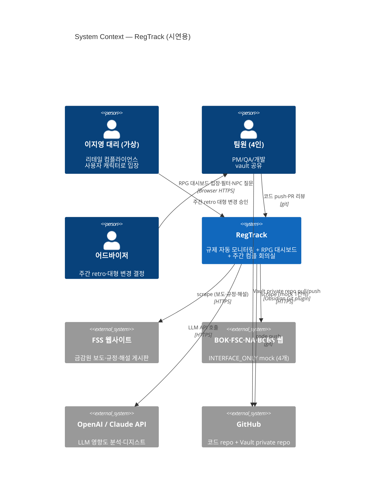

**핵심 관계**:
- 사용자는 브라우저로만 RegTrack에 접근 (시연용, 1인 모드)
- Vault는 RegTrack에서 markdown만 작성 → Obsidian Git plugin을 통해 사용자가 수동 push (D-6 v2)
- 외부 시스템: 5개 규제 사이트 + LLM API + GitHub

---

### 1.2 Container (Level 2)

> RegTrack 내부의 배포 단위(container). docker compose 4개 서비스 + Vault 디렉토리.

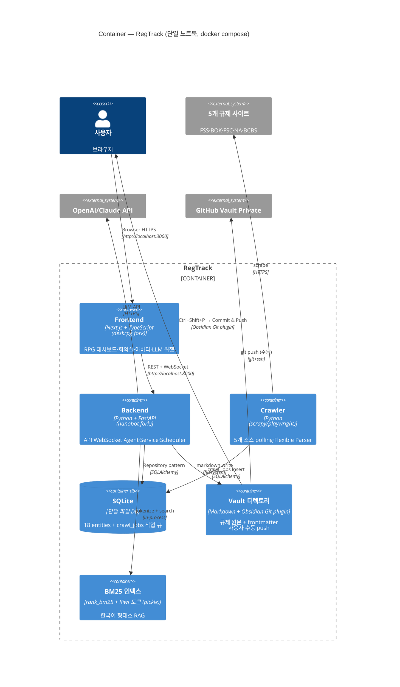

**왜 이 분리인가**:
- **Frontend ↔ Backend**: REST + WebSocket (D-1)
- **Crawler ↔ Backend**: 공유 SQLite 작업 큐 (D-2) — 다른 인프라 0
- **Vault sync**: Obsidian Git plugin (D-6 v2) — 백엔드 git subprocess 제거

---

### 1.3 Component — Backend (Level 3)

> Backend 컨테이너 내부의 모듈 구조 (TRD §2.2 매핑).

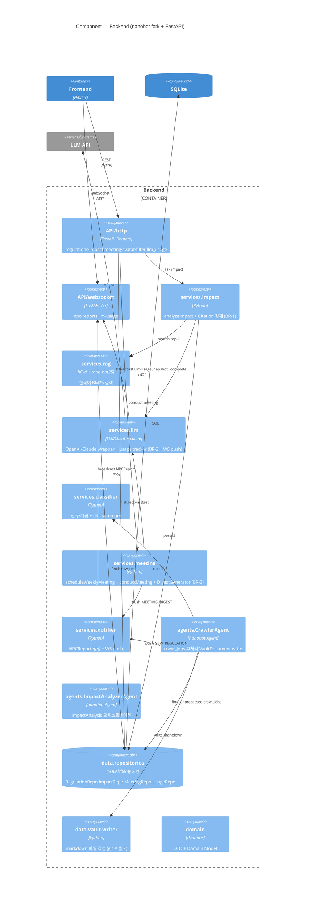

**비즈니스 규칙 위치**:
- BR-1 (Citation 강제): `services.impact`
- BR-2 (LLM 예산 가드 + 위젯 push): `services.llm`
- BR-3 (회의 디지스트 4항목): `services.meeting`

---

### 1.4 Component — Frontend (Level 3)

> Frontend 컨테이너 내부의 컴포넌트 트리 + 상태 관리.

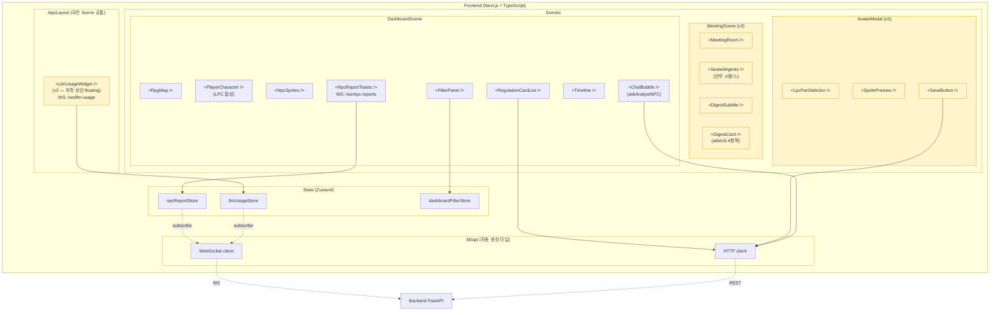

> 노랑 박스는 v2 신규 (LLM 위젯 + 회의실 + 아바타 모달).

---

## 2. 시퀀스 다이어그램

### SEQ-1 사용자 캐릭터 입장

> AC-005 Frame 1. `enterDashboard` 액션.

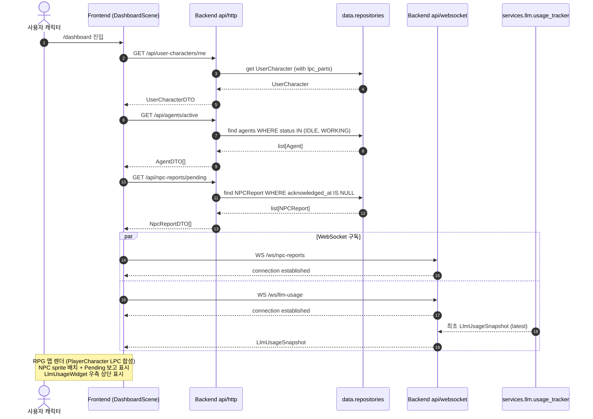

---

### SEQ-2 크롤링 → 신규 발견 → NPC Report

> AC-001, AC-002. `crawlRegulationSource` + `classifyChangeType` + NPCReport push.

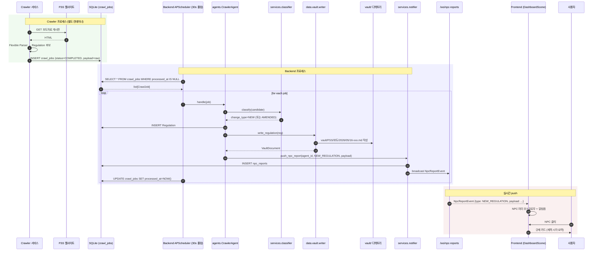

> AC-002 latency 측정: `CrawlJob.finished_at` → `NPCReport.created_at` 차이가 ≤ 1h.

---

### SEQ-3 askAnalystNPC → RAG → Citation

> AC-003, AC-005 Frame 3-4. **BR-1 Citation 강제** 규칙 적용.

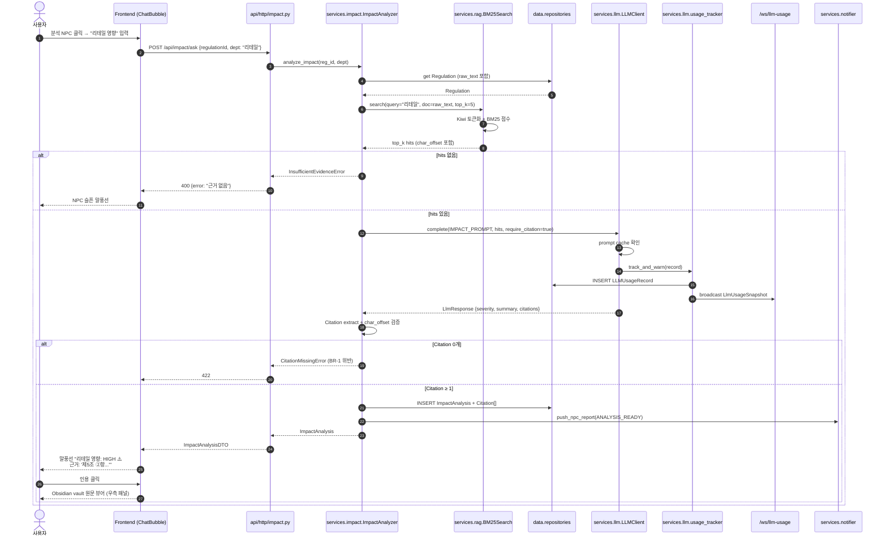

> **핵심**: Citation 0개면 분석 자체를 reject (BR-1). hallucination 방어 강제.

---

### SEQ-4 LLM 사용량 위젯 실시간 push

> AC-008 (v3·v4 high). 모든 Scene 공통 floating 위젯이 매 LLM 호출 직후 갱신.

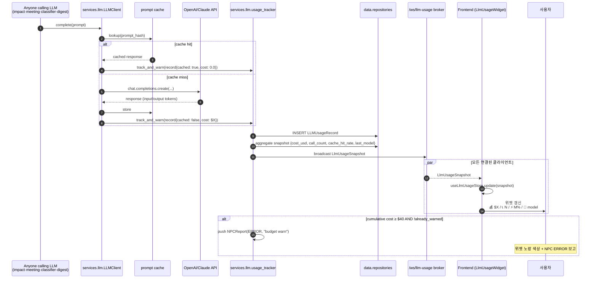

---

### SEQ-5 주간 회의 conduct → 디지스트 → 낭독

> AC-011. **BR-3 디지스트 4항목 강제** + D-4 클라이언트 자체 애니메이션.

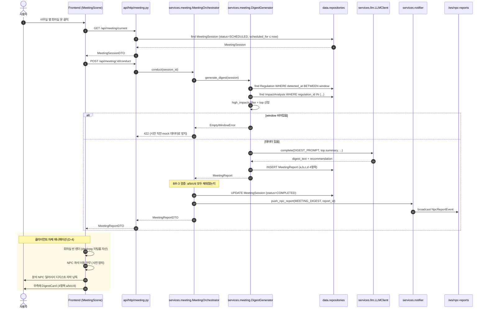

---

### SEQ-6 LPC 아바타 커스터마이징

> AC-012. `customizeAvatar` 액션 + 영속화 + 재로드.

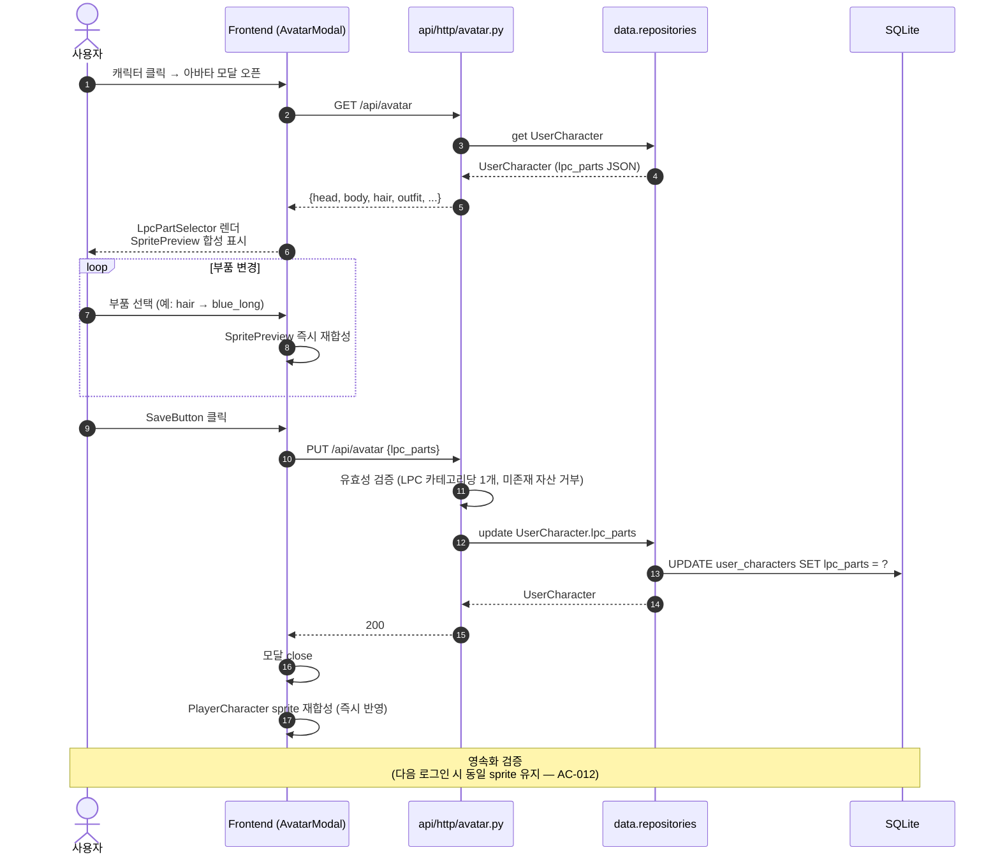

---

### SEQ-7 Vault 작성 + Obsidian Git plugin push

> AC-006 (v4 단순화). 백엔드는 markdown만 작성, push는 사용자가 Obsidian에서 수동.

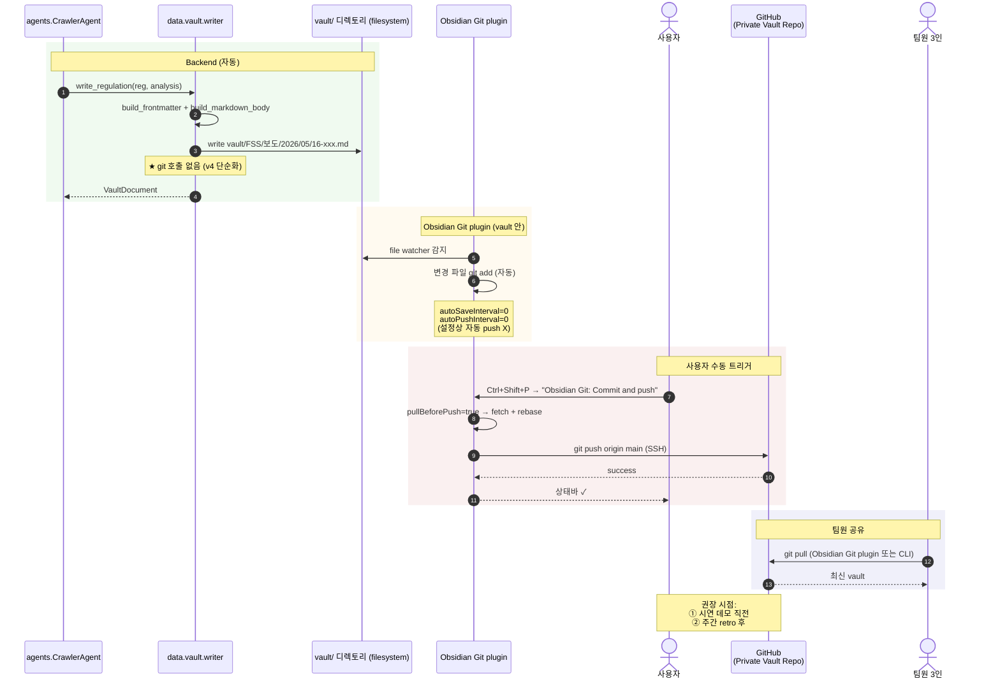

---

## 3. Deployment

> 단일 노트북 + docker compose 구성. TRD §8 참조.

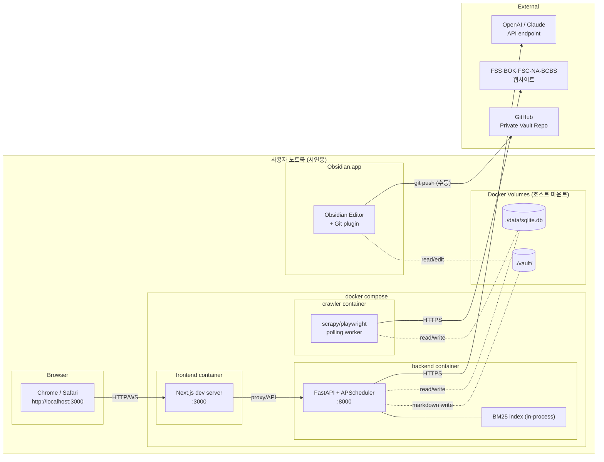

**환경 변수** (`.env.local`, 호스트):
```
OPENAI_API_KEY=...
ANTHROPIC_API_KEY=...
VAULT_GIT_REMOTE=git@github.com:org/regtrack-vault-private.git
LLM_BUDGET_WARN_USD=40.0
DEFAULT_LLM_MODEL=gpt-4o-mini
```

---

## 4. Layer Dependency 검증 (게이트)

> ARCHITECTURE_INVARIANTS Part 1의 절대 규칙을 시각화. `.harness/gates/check-layers.sh`로 자동 검증.

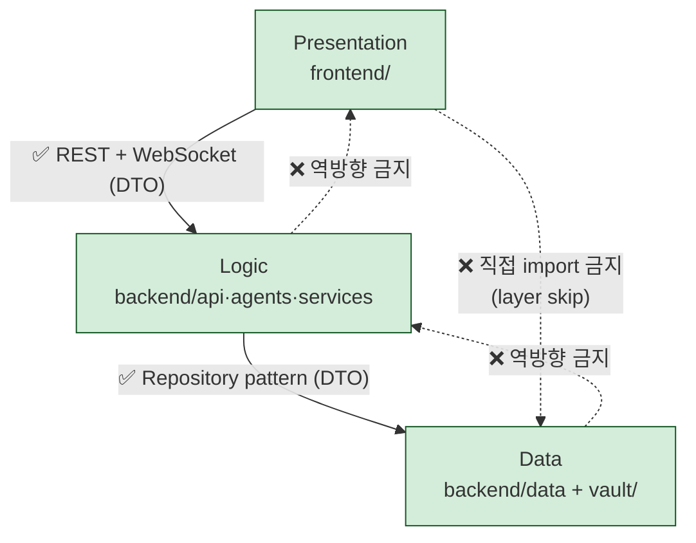

### 위반 예시 (게이트가 차단)
```
❌ frontend/components/RegulationCard.tsx
     import { PrismaClient } from "../../backend/data/..."  // layer skip
❌ backend/data/repositories/regulation_repo.py
     from backend.services.impact import analyzer   // 역방향
❌ backend/services/impact/analyzer.py
     from frontend.components import Modal          // 역방향
```

### 게이트 명령
```bash
.harness/gates/check-layers.sh        # 레이어 분리
.harness/gates/check-boundaries.sh    # 의존성 경계 (boundaries.yaml)
.harness/gates/check-structure.sh     # 디렉토리 구조
```

---

## 5. References

- **Seed**: `.harness/ouroboros/seeds/seed-v4.yaml`
- **PRD**: `docs/prd/PRD-RegTrack-2026-05-16.md` (v4)
- **TRD**: `docs/trd/TRD-RegTrack-2026-05-16.md` (v2)
- **Architecture Invariants**: `ARCHITECTURE_INVARIANTS.md`
- **Boundaries Rules**: `.harness/gates/rules/boundaries.yaml`
- **Mermaid C4 spec**: https://mermaid.js.org/syntax/c4.html
- **Mermaid sequenceDiagram**: https://mermaid.js.org/syntax/sequenceDiagram.html
- **C4 Model**: https://c4model.com/
