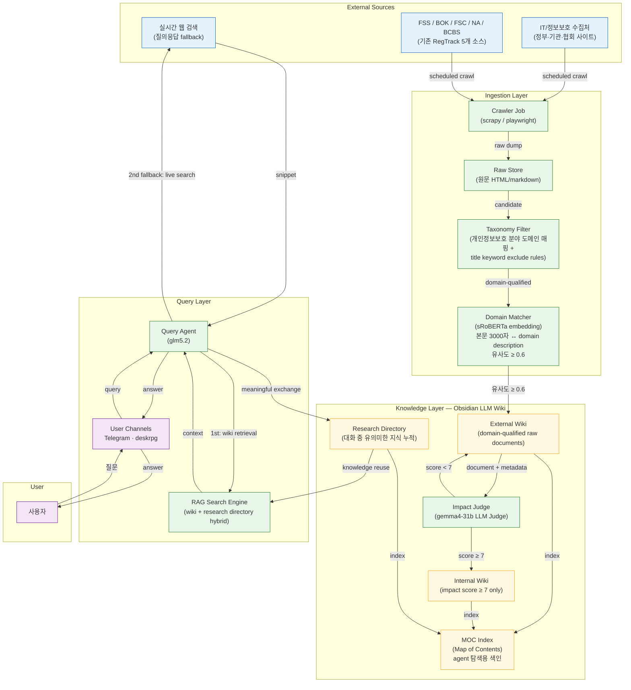
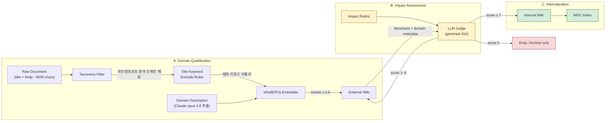
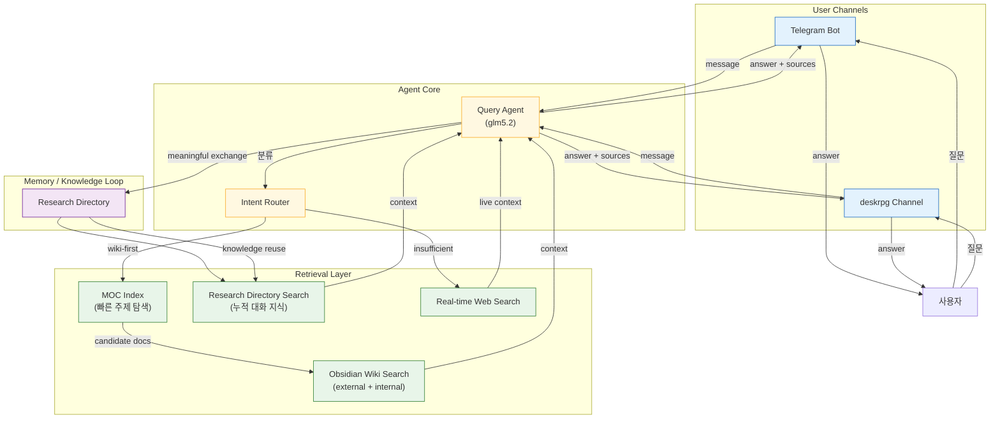
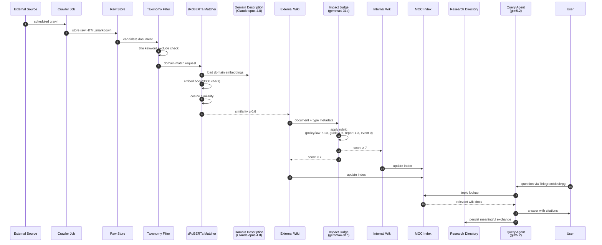
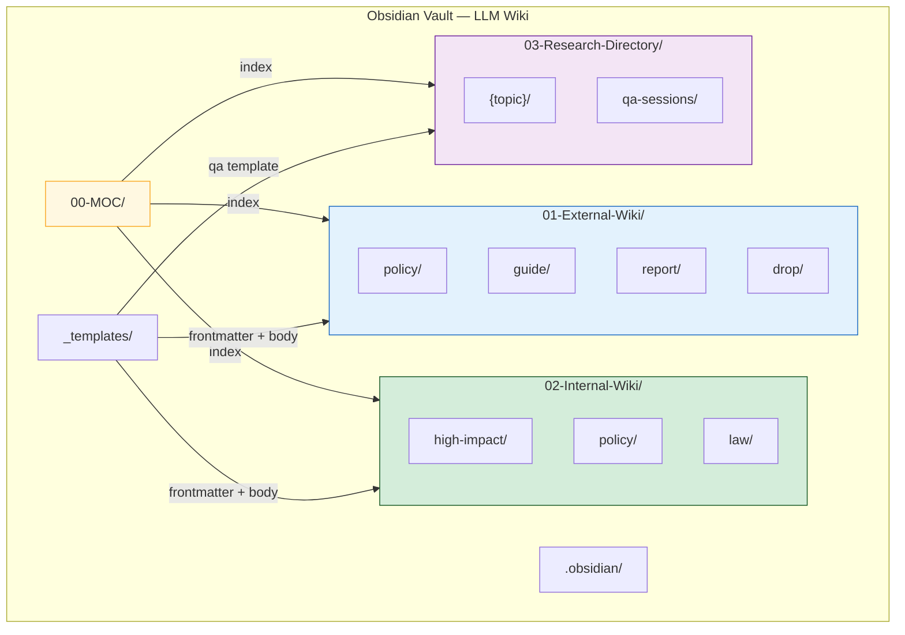

# Architecture — RegTrack LLM Wiki (지식 생산·소비·재사용 시스템)

> 본 문서는 RegTrack 프로젝트의 **LLM Wiki 기반 지식 운영 아키텍처**를 시각화합니다.
> 외부 규제/IT·정보보호 소스를 수집하여 Obsidian `external wiki`, `internal wiki`, `research directory`로 계층화하고,
> 이를 Telegram / deskrpg 채널의 질의응답 에이전트가 재사용하는 전체 구조를 정의합니다.
>
> 모든 수치 기준은 본 문서가 권위를 갖습니다. 특히 **domain 유사도 임계값 0.6**은 절대 하드 기준입니다.

| 항목 | 내용 |
|------|------|
| **버전** | v1 |
| **작성일** | 2026-07-18 |
| **포맷** | Mermaid (C4 + flowchart + sequenceDiagram) |
| **출처** | 사용자 인터뷰 기반 아키텍처 결정 |

---

## 목차

- [1. 통합 시스템 아키텍처](#1-통합-시스템-아키텍처)
- [2. Domain Qualification & Impact Scoring 파이프라인](#2-domain-qualification--impact-scoring-파이프라인)
- [3. 질의응답 & 지식 재사용 아키텍처](#3-질의응답--지식-재사용-아키텍처)
- [4. 단일 문서 라이프사이클](#4-단일-문서-라이프사이클)
- [5. Obsidian Vault 구조](#5-obsidian-vault-구조)
- [6. 모델/도구 역할 매트릭스](#6-모델도구-역할-매트릭스)
- [7. 핵심 설계 결정](#7-핵심-설계-결정)
- [8. References](#8-references)

---

## 1. 통합 시스템 아키텍처

> 외부 소스 → 수집 → domain qualification → impact scoring → Obsidian Wiki 계층 → 질의응답 → 연구 지식 적재의 전체 그림.



---

## 2. Domain Qualification & Impact Scoring 파이프라인

> 문서가 어떻게 external wiki로 들어가고, 어떤 기준으로 internal wiki로 승격되는지 상세화.



### 2.1 Domain Description 생성

- **모델**: Claude opus 4.8
- **입력**: 특정 기간 동안 수집된 IT/정보보호 분야 문서들
- **출력**: 개인정보보호 분야 domain description
- **용도**: sRoBERTa 매의 기준 벡터로 사용. domain description은 상대적으로 안정적이며 주기적으로 재생성 가능.

### 2.2 Domain 매칭 기준

| 항목 | 기준 | 비고 |
|------|------|------|
| 본문 길이 | 약 **3000자** | 일관된 임베딩 길이 확보 |
| 임베딩 모델 | **sRoBERTa** | 한국어 문장/단락 수준 유사도에 강함 |
| 유사도 임계값 | **≥ 0.6** | 본 문서의 절대 기준. 미만은 external wiki 편입 거부 |
| title keyword | exclude rules 적용 | 특정 키워드가 포함된 제목은 사전 필터링 |

### 2.3 영향도 루브릭 (LLM Judge Input)

| 외규 유형 | 영향 범위 | 점수 | Internal Wiki 편입 |
|---|---|---|---|
| 정책 / 고시 / 법령 | 처리방침에 영향 | **7 ~ 10** | ✅ 예 |
| 가이드라인 / 해설서 | 운영에 영향 | **4 ~ 6** | ❌ 아니오 (external에 유지) |
| 보도자료 / 연구결과 | 정보 참고 수준 | **1 ~ 3** | ❌ 아니오 |
| 행사 / 시상 / 발간물 안내 | 영향 없음 | **0** | 🗑️ drop 또는 archive only |

> **gemma4-31b**가 루브릭을 기반으로 판단하며, 7점 이상일 때만 internal wiki로 승격합니다.

---

## 3. 질의응답 & 지식 재사용 아키텍처

> 사용자가 Telegram / deskrpg에서 질문하면, agent가 wiki를 먼저 검색하고 부족할 때만 실시간 웹 검색을 사용. 유의미한 대화는 research directory에 누적.



### 3.1 검색 우선순위

1. **MOC Index**: 빠른 주제 탐색 및 후보 문서 라우팅
2. **Internal Wiki**: 높은 영향도를 가진 핵심 규제/정책 문서
3. **External Wiki**: domain-qualified 참고 문서
4. **Research Directory**: 과거 유의미한 질의응답에서 축적된 지식
5. **실시간 웹 검색**: 위 4개로 답변 불가 시 fallback

### 3.2 지식 재사용 루프

- Query Agent가 사용자와의 대화에서 **유의미한 교환**을 식별하면 자동으로 research directory에 markdown로 적재.
- 적재된 내용은 향후 동일/유사 주제 질문 시 RAG context로 재사용.
- 이 구조로 **지식이 소모되지 않고 누적**됩니다.

---

## 4. 단일 문서 라이프사이클

> 하나의 외부 문서가 수집부터 질의응답 context까지 거치는 전체 메시지 흐름.



---

## 5. Obsidian Vault 구조

> LLM Wiki의 실제 저장소 구조. external / internal / research directory / MOC로 분리.



### 5.1 디렉토리 책임

| 경로 | 책임 | 편입 조건 |
|------|------|----------|
| `00-MOC/` | 전체 wiki의 색인. 주제별 landing page | 수동/반자동 유지 |
| `01-External-Wiki/` | domain-qualified 문서 원문 저장 | sRoBERTa 유사도 ≥ 0.6 |
| `02-Internal-Wiki/` | 높은 영향도 문서 저장 | LLM Judge score ≥ 7 |
| `03-Research-Directory/` | 유의미한 Q&A 누적 저장소 | Query Agent 판단 |
| `_templates/` | 문서 작성 템플릿 | - |
| `.obsidian/` | Obsidian 설정 + Git plugin | - |

### 5.2 문서 frontmatter 예시

```yaml
---
regulation_id: 7c3a-...
external_id: FSS-2026-05-15-001
source: FSS
board_type: 보도
change_type: NEW
impact_score: 8
impact_tier: internal   # external | internal | research
published_at: 2026-05-15T09:00
detected_at: 2026-05-15T09:32
domain_similarity: 0.72
target_departments: [리테일, 정보보호]
source_url: https://fss.or.kr/...
---
```

---

## 6. 모델/도구 역할 매트릭스

> 복잡한 파이프라인에서 각 모델/도구가 담당하는 역할을 명확히 분리.

| 모델/도구 | 역할 | 위치 | 입력 | 출력 |
|---|---|---|---|---|
| **Crawler Job** | 외부 소스 일배치 수집 | Ingestion Layer | external URLs | Raw Store |
| **Taxonomy Filter** | 도메인 매핑 + title keyword 제외 | Ingestion Layer | raw title/body | candidate / rejected |
| **Claude opus 4.8** | Domain description 추출 | Ingestion Layer | 수집된 IT/정보보호 문서 집합 | domain description |
| **sRoBERTa** | 본문-domain description 유사도 계산 | Ingestion Layer | 3000자 본문 + domain desc | cosine similarity |
| **gemma4-31b** | 영향도 루브릭 기반 LLM Judge | Knowledge Layer | external wiki 문서 + 메타데이터 | impact score 0~10 |
| **glm5.2** | 질의응답 Query Agent | Query Layer | 사용자 질문 + RAG context | 답변 + 출처 |
| **Obsidian MOC** | 주제 색인 | Knowledge Layer | wiki + research directory 링크 | 탐색용 landing page |
| **Obsidian Git plugin** | Vault sync | Knowledge Layer | vault markdown | GitHub private repo |

---

## 7. 핵심 설계 결정

### D-W1: Domain 유사도 임계값 = 0.6

- **결정**: sRoBERTa 유사도 ≥ 0.6일 때만 external wiki로 편입.
- **이유**: 0.45는 domain-qualified 문서에 대한 정밀도가 낮아 external wiki 노이즈가 증가. 0.6으로 상향하여 후속 LLM Judge와 RAG 품질을 확보.
- **대안**: 0.5 (recall ↑, precision ↓) / 0.7 (precision ↑, recall ↓)
- **Trade-off**: recall 일부 희생, 그러나 질의응답 context 품질 향상.

### D-W2: Impact scoring은 별도 LLM Judge (gemma4-31b)

- **결정**: external wiki로 들어온 문서를 gemma4-31b가 루브릭 기반으로 다시 평가.
- **이유**: domain qualification과 영향도 판단은 책임이 다름. domain은 "우리 주제냐", impact는 "우리 업무에 얼마나 중요하냐".
- **Trade-off**: 2단계 필터링으로 지연 ↑, 품질 ↑.

### D-W3: Internal / External / Research Directory 3계층

- **결정**: 단일 vault가 아닌 3개 디렉토리로 명시적 분리.
- **이유**: 검색 우선순위, 지식 생명주기, 권한/중요도가 다름. 한 디렉토리에 섞이면 RAG noise 증가.
- **Trade-off**: 관리 복잡도 ↑, 검색 정확도 ↑.

### D-W4: MOC(Map of Contents) 사전 구축

- **결정**: agent가 빠르게 정보를 찾을 수 있도록 MOC를 사전에 생성하고 지속 갱신.
- **이유**: 단순 full-text 검색은 느리고 정확도가 낮음. MOC는 semantic topic cluster 역할.
- **Trade-off**: 초기 구축 공수 ↑, 질의응답 latency ↓.

### D-W5: 지식 재사용을 위한 Research Directory 적재

- **결정**: 유의미한 대화를 자동으로 research directory에 저장.
- **이유**: 외부 문서만으로는 조직 내부 해석/사례/FAQ가 누적되지 않음. 대화 지식을 자산화.
- **Trade-off**: 저장 기준(의미 있는 대화)을 명확히 정의해야 함.

### D-W6: Query Agent의 wiki-first, web-fallback 전략

- **결정**: 질의응답 시 wiki(Internal → External → Research)를 먼저 검색하고, 답변 불충분 시 실시간 웹 검색 fallback.
- **이유**: 비용 통제 + hallucination 감소 + 출처 기반 답변. 실시간 검색은 마지막 수단.
- **Trade-off**: 최신성 ↓(fallback 전까지), 비용/안정성 ↑.

---

## 8. References

- `ARCHITECTURE_INVARIANTS.md` — 3-tier layer 분리, 계약 기반 통신
- `docs/architecture/ARCHITECTURE-RegTrack-2026-05-16.md` — RegTrack 기존 C4/시퀀스 다이어그램
- `docs/trd/TRD-RegTrack-2026-05-16.md` — 3-tier 레이어, 서비스 책임, D-1~D-7
- `.harness/ouroboros/seeds/seed-v11.yaml` — ReportPanel / agent_reports 추가 사양
- 본 문서: `docs/architecture/ARCHITECTURE-RegTrack-LLM-Wiki-2026-07-18.md`
