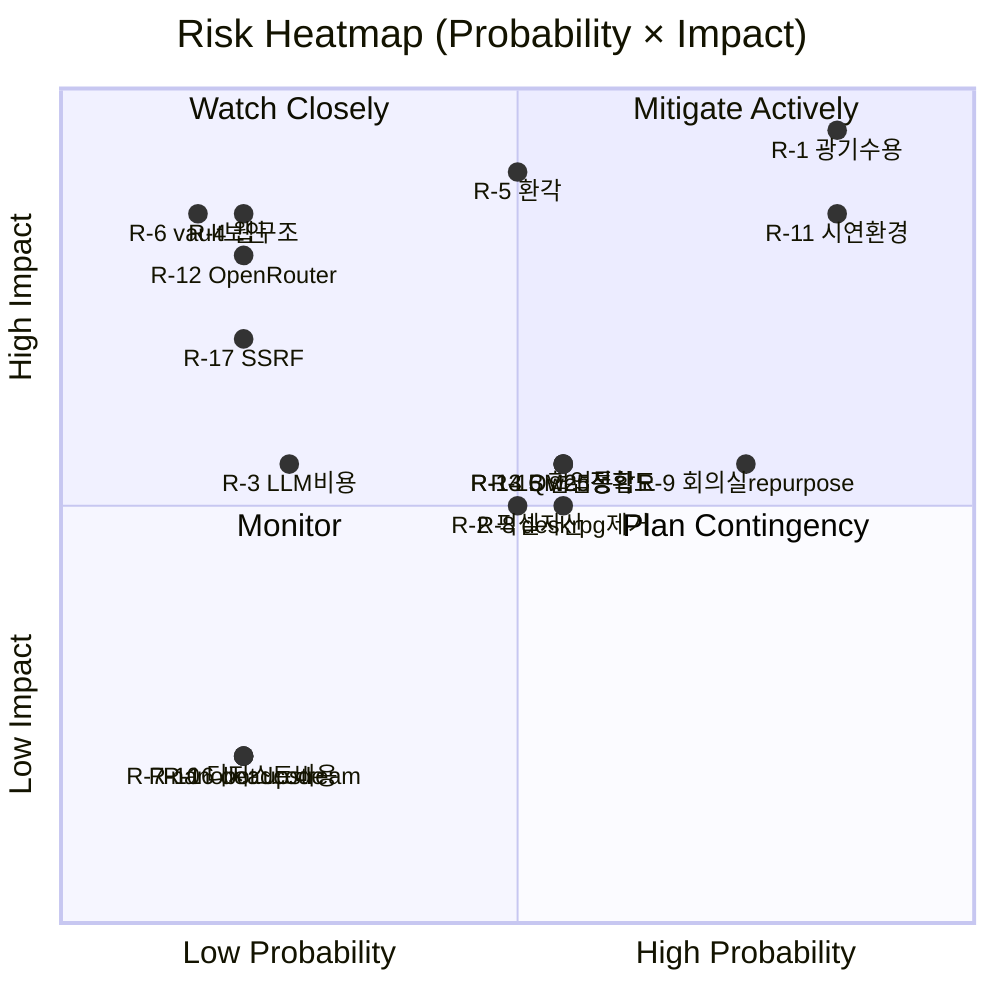
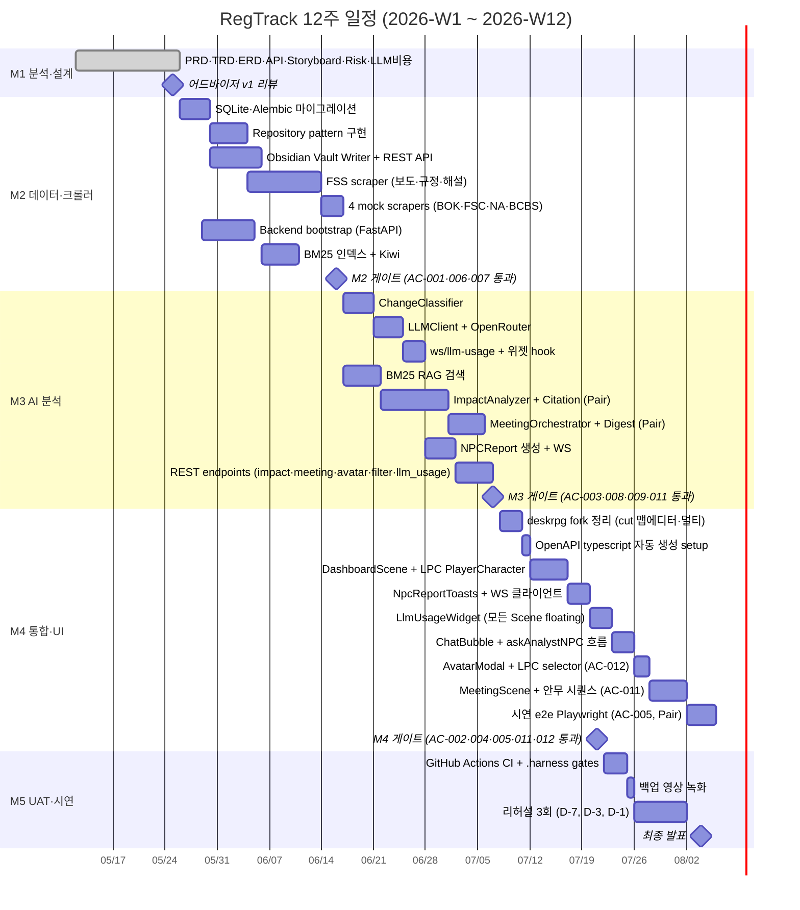

# Risk Register & 12주 마일스톤 갠트 — RegTrack

> 차터 식별 risk + 인터뷰 surfaced assumptions + 진행 중 발견된 추가 risk를 통합 관리.
> seed-v6 + Scope Change Governance §17과 통합. 매주 금요일 30분 retro에서 점검.

| 항목 | 내용 |
|------|------|
| **버전** | v1 |
| **작성일** | 2026-05-16 |
| **출처** | Project Charter · seed-v6 · interviews/2026-05-16-10-12.yaml · PRD §10 |
| **갱신 주기** | 주 1회 금요일 retro |
| **owner** | 김지효 (PM, RACI 최종) + 팀 4인 (실행) |

---

## 목차

- [1. Risk 분류 체계](#1-risk-분류-체계)
- [2. Risk Register (17개)](#2-risk-register-17개)
- [3. Risk Heatmap](#3-risk-heatmap)
- [4. 12주 마일스톤 갠트](#4-12주-마일스톤-갠트)
- [5. Risk-Milestone 매트릭스](#5-risk-milestone-매트릭스)
- [6. 양보 우선순위 (slip cascade)](#6-양보-우선순위-slip-cascade)
- [7. Decision Triggers (Risk → Action)](#7-decision-triggers-risk--action)
- [8. Risk Monitoring Cadence](#8-risk-monitoring-cadence)

---

## 1. Risk 분류 체계

### Category
| Code | 설명 |
|------|------|
| **TECH** | 기술·아키텍처·의존성 |
| **SCOPE** | 범위·요구사항 변경 |
| **SCHED** | 일정·자원·역량 |
| **EXT** | 외부 서비스·환경 의존 |
| **TEAM** | 협업·역할·의사소통 |
| **SEC** | 보안·민감정보 |

### Severity (Probability × Impact)
```
        Impact:   Low(1)  Medium(2)  High(3)
Prob:
High(3)         Med      High       Critical
Med(2)          Low      Med        High
Low(1)          Low      Low        Med
```

### Status
- `OPEN` — 활성 risk, mitigation 진행 중
- `MITIGATED` — 대응 완료, 잔여 영향만
- `ACCEPTED` — 의도적 수용 (광기 수용 등)
- `CLOSED` — 트리거 미발생 또는 우회 완료
- `WATCH` — 모니터링만

---

## 2. Risk Register (17개)

### R-1 스코프 광기 수용

| 필드 | 값 |
|------|------|
| **Category** | SCOPE |
| **Probability** | High |
| **Impact** | High |
| **Severity** | **Critical** |
| **Status** | **ACCEPTED** (사용자 명시 결정) |
| **Owner** | 김지효 (PM) |
| **Source** | seed-v1 user decision, PRD §10 R-1 |
| **Trigger** | 마일스톤 1개 이상 슬립 (M2/M3/M4 게이트 통과 실패) |
| **Mitigation** | (1) 양보 우선순위 §6 발동 (2) 다음 retro에서 재평가 (3) 어드바이저 알림 |
| **Contingency** | seed-vN 발급 + scope 재정의 |

### R-2 픽셀 아트 자산 디자인 역량

| 필드 | 값 |
|------|------|
| **Category** | TEAM · SCOPE |
| **Probability** | Medium |
| **Impact** | Medium |
| **Severity** | Medium |
| **Status** | MITIGATED (seed-v1: deskrpg 기본 자산 재활용) |
| **Owner** | 팀 합의 (담당자 미정) |
| **Source** | interviews surfaced #2 |
| **Trigger** | W9 시점에 시연 화면이 너무 deskrpg 원본과 똑같음 |
| **Mitigation** | MVP는 기본 자산 + 색상·이름 변경만 (시각적 차별화 최소) |
| **Contingency** | LPC 커스터마이징(AC-012)으로 player만이라도 개성 강조 |

### R-3 LLM 비용 초과

| 필드 | 값 |
|------|------|
| **Category** | EXT · TECH |
| **Probability** | Medium → **Low** (v6: Qwen 저렴 + 단계별 임계치) |
| **Impact** | Medium |
| **Severity** | **Low** (v6 격하) |
| **Status** | MITIGATED |
| **Owner** | 이득규 (개발) |
| **Source** | seed-v1, v6 강화 |
| **Trigger** | LlmUsageSnapshot.threshold_level = YELLOW($30) |
| **Mitigation** | (1) AC-008 단계별 가드: YELLOW→ORANGE→RED (2) prompt cache 적극 (3) Qwen 모델 (저렴) (4) BUDGET_EXCEEDED 자동 차단 |
| **Contingency** | $90 도달 시 LLM 호출 중단 + 시연용 사전 캐싱 fixture 활용 |

### R-4 소스 웹 구조 변경

| 필드 | 값 |
|------|------|
| **Category** | EXT |
| **Probability** | Low (12주 단기) |
| **Impact** | High (FSS 크롤러 실패 시 AC-001 위반) |
| **Severity** | Medium |
| **Status** | OPEN (Flexible Parser 설계로 mitigation) |
| **Owner** | 이득규 (Crawler 담당) |
| **Source** | 차터 Risks |
| **Trigger** | `CrawlJob.parser_error IS NOT NULL` 또는 `items_found < expected` |
| **Mitigation** | (1) Flexible Parser 추상화 (2) parser_error 알림 즉시 (3) parser_config JSON 외부화 (Hot update) |
| **Contingency** | mock 데이터로 시연 fallback (AC-007 활용) |

### R-5 LLM 환각 (Hallucination)

| 필드 | 값 |
|------|------|
| **Category** | TECH · EXT |
| **Probability** | Medium (Qwen 한국어 정확도 미검증) |
| **Impact** | High (AC-003 위반 = 시연 wow → oops) |
| **Severity** | **High** |
| **Status** | MITIGATED (BR-1 Citation 강제) |
| **Owner** | 이득규 (분석 NPC 담당) |
| **Source** | 차터 Risks |
| **Trigger** | Citation 0개 응답 또는 char_offset 범위 외 |
| **Mitigation** | (1) BR-1 강제: Citation 0개 시 422 reject (2) char_offset 검증 (3) require_citation=true 프롬프트 (4) 필요 시 HITL |
| **Contingency** | 시연 직전 사전 캐싱 fixture로 응답 보장 |

### R-6 Obsidian Vault Git Sync 보안

| 필드 | 값 |
|------|------|
| **Category** | SEC |
| **Probability** | Low |
| **Impact** | High (민감 규제 본문·credential 노출) |
| **Severity** | Medium |
| **Status** | MITIGATED (private repo 강제 + 시연 직전 manual grep) |
| **Owner** | 팀 4인 공동 (vault push 사용자가 책임) |
| **Source** | interviews surfaced #6 |
| **Trigger** | vault repo가 public으로 전환되거나, push 전 secret grep 누락 |
| **Mitigation** | (1) seed-v4: private repo 강제 (2) D-6: 시연 직전 manual 감사 (3) .gitignore에 .env 패턴 |
| **Contingency** | 노출 발견 시 repo 즉시 비공개 + git history 재작성 + 토큰 회전 |

### R-7 nanobot Upstream 추적

| 필드 | 값 |
|------|------|
| **Category** | TECH |
| **Probability** | Low (12주 freeze) |
| **Impact** | Low |
| **Severity** | **Low** |
| **Status** | ACCEPTED (시연 후 재평가) |
| **Owner** | 이득규 |
| **Source** | seed-v1 tech_decision |
| **Trigger** | nanobot upstream에 보안 패치 release |
| **Mitigation** | 12주 동안 fork 시점 freeze. 시연 후 rebase 평가 |
| **Contingency** | hot-fix만 cherry-pick |

### R-8 deskrpg 무관 기능 제거 공수

| 필드 | 값 |
|------|------|
| **Category** | TECH · SCHED |
| **Probability** | Medium |
| **Impact** | Medium |
| **Severity** | Medium |
| **Status** | MITIGATED (v2: 맵 에디터·멀티플레이어만 제거, AI 미팅룸은 repurpose) |
| **Owner** | 이득규 (deskrpg fork 담당) |
| **Source** | PRD §10 R-8 (v2 갱신) |
| **Trigger** | W2 spike에서 제거 범위 결정 못 함 |
| **Mitigation** | hidden 처리 가능 (라우팅만 막음) |
| **Contingency** | 빌드 사이즈 ↑ 수용 + 시연 시 hidden 라우트 안 보임 |

### R-9 AI 미팅룸 Repurpose 추가 스코프 (v2)

| 필드 | 값 |
|------|------|
| **Category** | SCOPE · SCHED |
| **Probability** | High |
| **Impact** | Medium |
| **Severity** | **High** |
| **Status** | OPEN |
| **Owner** | 이득규 |
| **Source** | PRD §10 R-9 (v2 추가) |
| **Trigger** | W9-W10 회의실 씬 통합 미완 |
| **Mitigation** | (1) AC-011 별도 트랙 (2) 클라이언트 자체 애니메이션 (D-4) — 백엔드 디지스트 1회만 (3) 시연일 D-7까지 통합 검증 |
| **Contingency** | **양보 우선순위 §6 우선 cut**. 메인 4단계만 시연 |

### R-10 회의 디지스트 LLM 추가 비용

| 필드 | 값 |
|------|------|
| **Category** | EXT |
| **Probability** | Low |
| **Impact** | Low |
| **Severity** | **Low** |
| **Status** | MITIGATED (Qwen 저렴) |
| **Owner** | 이득규 |
| **Source** | PRD §10 R-10 (v2 추가) |
| **Trigger** | 주 1회 디지스트 호출 비용 누적 |
| **Mitigation** | Qwen 모델 + prompt cache. 시연 기간 ~$5 추가 흡수 가능 |

### R-11 시연 환경 미결정 (Windows VM vs Mac 단일)

| 필드 | 값 |
|------|------|
| **Category** | EXT · TEAM |
| **Probability** | High (현재 결정 보류) |
| **Impact** | High (Obsidian 호스트 IP·docker-compose·발표자 노트북) |
| **Severity** | **High** |
| **Status** | OPEN — PM 회의 안건 (seed-v6 pending) |
| **Owner** | 김지효 (PM) |
| **Source** | seed-v6 resolved_ambiguities |
| **Trigger** | W3 데이터 연동 시작 전까지 환경 미정 |
| **Mitigation** | 다음 retro 1순위 안건 → 즉시 결정 → seed-v7 발급 |
| **Contingency** | Mac 단일 노트북 가정 진행 (사용자 = 이득규 환경) |

### R-12 OpenRouter API 가용성

| 필드 | 값 |
|------|------|
| **Category** | EXT |
| **Probability** | Low (운영 안정) |
| **Impact** | High (시연 중 LLM 호출 실패) |
| **Severity** | Medium |
| **Status** | OPEN |
| **Owner** | 이득규 |
| **Source** | v6 신규 |
| **Trigger** | API 5xx 또는 timeout |
| **Mitigation** | (1) prompt cache (24h TTL) (2) 사전 캐싱 fixture (storyboard §7.2) (3) retry 3회 + 백오프 |
| **Contingency** | 백업 영상으로 시연 전환 |

### R-13 Qwen 모델 한국어 정확도 미검증

| 필드 | 값 |
|------|------|
| **Category** | TECH |
| **Probability** | Medium |
| **Impact** | Medium (영향도 분석 품질) |
| **Severity** | Medium |
| **Status** | OPEN |
| **Owner** | 이득규 |
| **Source** | v6 신규 |
| **Trigger** | W6-W7 ImpactAnalyzer 통합 후 hit rate < 70% |
| **Mitigation** | (1) W6 첫 주에 Qwen 정확도 benchmark (2) 미달 시 다른 Qwen 변종 또는 Claude로 전환 평가 |
| **Contingency** | seed-v7로 모델 변경 (qwq-32b-preview 추론 특화 등) |

### R-14 BM25 + Kiwi 한국어 RAG 정확도

| 필드 | 값 |
|------|------|
| **Category** | TECH |
| **Probability** | Medium |
| **Impact** | Medium (Citation 품질) |
| **Severity** | Medium |
| **Status** | OPEN |
| **Owner** | 이득규 |
| **Source** | TRD §6 D-3 재평가 트리거 |
| **Trigger** | hit rate < 70% (한국어 형태소 매칭 실패) |
| **Mitigation** | (1) Kiwi stopwords 튜닝 (2) Obsidian search API 보조 hybrid (3) 필요 시 MeCab 전환 |
| **Contingency** | pgvector + embedding 추가 (stretch goal 활성화) |

### R-15 팀 협업 — Base Repo 다중 브랜치 통합

| 필드 | 값 |
|------|------|
| **Category** | TEAM |
| **Probability** | Medium |
| **Impact** | Medium |
| **Severity** | Medium |
| **Status** | OPEN |
| **Owner** | 김지효 (PM) + Git 머지 담당자 |
| **Source** | base repo clone 결과 (dev, feat/add-obsidian-skill, feat/custom-docker, fork/nanobot-...) |
| **Trigger** | 4명이 다른 브랜치에서 충돌 변경 |
| **Mitigation** | (1) feature → dev → main 흐름 강제 (2) 마일스톤마다 dev 머지 (3) 주간 retro에서 PR 리뷰 |
| **Contingency** | 충돌 시 PM이 머지 우선순위 결정 |

### R-16 nanobot Built-in Skills Dead Code

| 필드 | 값 |
|------|------|
| **Category** | TECH |
| **Probability** | Low |
| **Impact** | Low (빌드 사이즈·attack surface) |
| **Severity** | **Low** |
| **Status** | ACCEPTED |
| **Owner** | 이득규 |
| **Source** | base repo clone (skills/: 13개 중 obsidian·github 외 11개 무관) |
| **Trigger** | 보안 감사에서 dead code 지적 |
| **Mitigation** | 시연 전 ImpactAnalyzerAgent.available_skills에 명시적 화이트리스트 |
| **Contingency** | 추가 skill 제거 (cron, weather 등) — 시연 후 |

### R-17 nanobot SSRF Whitelist 누락

| 필드 | 값 |
|------|------|
| **Category** | SEC · TECH |
| **Probability** | Low (설정 누락 시 발생) |
| **Impact** | High (Obsidian REST API 호출 차단) |
| **Severity** | Medium |
| **Status** | OPEN |
| **Owner** | 이득규 |
| **Source** | `nanobot/docs/obsidian-interface.md` Step 5 |
| **Trigger** | Obsidian 호출 403 또는 connection refused |
| **Mitigation** | (1) seed-v5 must_not에 명시 (2) `~/.nanobot/config.json`에 `192.168.56.1/32` 등록 (3) preflight 스크립트에 ping 포함 |
| **Contingency** | 시연 30분 전 config 재확인 |

---

## 3. Risk Heatmap

> Severity × Probability 시각화. 색상 = Severity 등급.



### 우선 대응 risks (Severity ≥ High)

| ID | Risk | Status | 즉각 행동 |
|----|------|--------|-----------|
| R-1 | 스코프 광기 수용 | ACCEPTED | 마일스톤 게이트 엄격 |
| R-5 | LLM 환각 | MITIGATED | BR-1 코드 검증 |
| R-9 | AI 미팅룸 repurpose | OPEN | W9-W10 트랙 모니터링 |
| R-11 | 시연 환경 미결정 | OPEN | **다음 retro 1순위** |

---

## 4. 12주 마일스톤 갠트

> 차터 WBS 기반. 마일스톤 게이트별 통과 AC 명시.



### 마일스톤 통과 기준

| Milestone | 종료일 | 통과 AC | 비고 |
|-----------|--------|---------|------|
| **M1** 분석·설계 | 2026-05-25 | 9개 문서 v1 + advisor 리뷰 | 본 문서 포함 |
| **M2** 데이터·크롤러 | 2026-06-16 | AC-001, AC-006, AC-007 | FSS 1개 소스 end-to-end + 4 mock |
| **M3** AI 분석 | 2026-07-07 | AC-003, AC-008, AC-009, AC-011 | LLM·Citation·위젯·디지스트 |
| **M4** 통합·UI | 2026-07-21 | AC-002, AC-004, AC-005, AC-011 (e2e), AC-012 | UI 풀 통합 |
| **M5** UAT·시연 | 2026-08-04 | AC-010 + 발표 | gates + UAT 통과 |

---

## 5. Risk-Milestone 매트릭스

> 각 risk가 어느 마일스톤 단계에서 가장 위험한지.

| Risk | M1 | M2 | M3 | M4 | M5 | 비고 |
|------|----|----|----|----|----|------|
| R-1 광기 수용 | 🟡 | 🟡 | 🟠 | 🔴 | 🟡 | M4 통합 시 최대 |
| R-2 픽셀 자산 | - | - | - | 🟡 | - | M4 시 UI 차별화 |
| R-3 LLM 비용 | - | - | 🟡 | 🟡 | 🟢 | Qwen 저렴 |
| R-4 웹구조 변경 | - | 🟠 | - | - | 🟡 | 시연 직전 재발생 위험 |
| R-5 LLM 환각 | - | - | 🟠 | 🟠 | 🟡 | Citation 강제로 mitigation |
| R-6 vault 보안 | - | 🟡 | - | - | 🟠 | 시연 직전 manual 감사 |
| R-7 nanobot upstream | - | - | - | - | - | 12주 freeze |
| R-8 deskrpg 제거 | - | - | - | 🟡 | - | M4 cut |
| R-9 회의실 repurpose | - | - | 🟡 | 🔴 | - | M4 통합 트랙 |
| R-10 디지스트 비용 | - | - | 🟢 | - | - | mitigated |
| R-11 시연 환경 | 🔴 | 🟠 | 🟡 | 🟡 | 🟡 | M1 안에 결정 필요 |
| R-12 OpenRouter | - | - | 🟡 | 🟡 | 🟠 | 시연일 최대 |
| R-13 Qwen 정확도 | - | - | 🟠 | 🟡 | - | M3 첫 주 benchmark |
| R-14 BM25 정확도 | - | 🟡 | 🟠 | - | - | M2-M3 시점 |
| R-15 협업 통합 | 🟡 | 🟡 | 🟡 | 🟡 | 🟡 | 매주 |
| R-16 dead code | - | - | - | - | 🟢 | M5 정리 |
| R-17 SSRF | - | 🟠 | 🟡 | - | 🟠 | M2 설정 + 시연 직전 |

**범례**: 🔴 Critical / 🟠 High / 🟡 Medium / 🟢 Low / `-` 영향 미미

---

## 6. 양보 우선순위 (slip cascade)

> R-1 (광기 수용) 발동 시 cut 순서. PRD §11 양보 우선순위 + 본 문서 보강.

| 우선순위 | Cut 대상 | 영향 AC | 회복 비용 |
|---------|---------|--------|----------|
| **①** | 4개 소스(BOK·FSC·NA·BCBS) interface 증명 | AC-007 약화 (mock 1건 → 0건) | seed-v7 발급 + README에 "FSS only" 명시 |
| **②** | deskrpg 고급 자산 (NPC 의상 다양화·이펙트) | 시연 wow ↓ (그래픽 단조) | 기본 자산만으로 시연 |
| **③** | **AI 미팅룸 보너스 (AC-011)** | 보너스 페이즈 제거 → 메인 5분만 | MeetingScene·BR-3 코드 삭제 또는 hidden |
| **④** | RAG 고도화 (pgvector stretch) | RAG 정확도 향상 포기 | BM25만으로 진행 |
| **⑤** | RegulationVersion 텍스트 diff 정교화 | AC-009 약화 (LLM 1줄 요약만) | 충분히 mitigated |

### 양보 발동 트리거

```
if M2_gate_date > 2026-06-23 (1주 지연):
    → ① 양보 발동 + advisor 알림
if M3_gate_date > 2026-07-14:
    → ②, ③ 양보 발동 + scope 재정의 retro
if M4_gate_date > 2026-07-28:
    → ④, ⑤ 양보 발동 + 시연 시나리오 단축 검토
```

---

## 7. Decision Triggers (Risk → Action)

> Risk 임계 도달 시 자동 또는 수동 의사결정 트리거.

| Risk | 트리거 조건 | 자동 행동 | 수동 의사결정 |
|------|-----------|-----------|--------------|
| R-3 LLM 비용 | `cost_usd ≥ $30` (YELLOW) | stderr 경고 + 위젯 색 변경 | retro에서 캐싱 강화 검토 |
| R-3 LLM 비용 | `cost_usd ≥ $60` (ORANGE) | NPCReport(ERROR) | 즉시 retro 소집 |
| R-3 LLM 비용 | `cost_usd ≥ $90` (RED) | LLM 호출 차단 | PM + 어드바이저 회의 |
| R-4 웹구조 | `parser_error IS NOT NULL` 3회 연속 | 알림 push | parser_config 수정 또는 fixture 전환 |
| R-5 환각 | `Citation count = 0` | 422 reject | retro에서 prompt 튜닝 |
| R-9 회의실 | M4 게이트 D-7일 통합 미완 | - | 양보 §6 ③ 발동 (AC-011 cut) |
| R-11 시연 환경 | M1 게이트 D-3일 미결정 | - | PM 단독 결정 (Mac 단일 default) |
| R-13 Qwen 정확도 | RAG hit rate < 70% | - | 모델 변경 평가 (seed-v7) |
| R-15 협업 | dev 브랜치 충돌 2회 연속 | - | PM이 머지 큐 정렬 |

---

## 8. Risk Monitoring Cadence

### 8.1 일간 (개발자 자율)

- 본인 담당 risk의 trigger 모니터링
- AC 테스트 실패 시 즉시 retro 안건 등록

### 8.2 주간 retro (금요일 30분, scope governance §17)

```markdown
## Retro 의제 (매주 금요일)

### 1. Risk Register 점검 (10분)
- 새 risk 발견? → R-N 추가
- status 변경된 risk? (OPEN→MITIGATED 등)
- High/Critical 우선 점검

### 2. 이번 주 진척 vs 계획 (10분)
- 갠트 차트 대비 실제 진행률
- 마일스톤 게이트 도달 가능성

### 3. 다음 주 우선순위 (10분)
- High severity risk 대응 plan
- 양보 §6 발동 여부 결정
```

### 8.3 마일스톤 게이트 (M1~M5)

- 게이트 통과 = AC 모두 PASS
- 미통과 시 → 양보 §6 발동 검토 → seed-vN 발급 가능

### 8.4 어드바이저 회의

- 트리거: Critical risk 발생 또는 대형 변경 (seed 발급) 시
- 빈도: 월 1회 + 트리거 시 임시

---

## 9. References

- **Project Charter**: `Project Charter_4팀_0514.docx`
- **Seed v6**: `.harness/ouroboros/seeds/seed-v6.yaml` (process_governance §17)
- **PRD §10·11·17**: `docs/prd/PRD-RegTrack-2026-05-16.md`
- **TRD §7 Implementation Order**: `docs/trd/TRD-RegTrack-2026-05-16.md`
- **ERD**: `docs/data-model/ERD-RegTrack-2026-05-16.md`
- **Storyboard**: `docs/demo-scenario/STORYBOARD-RegTrack-2026-05-16.md`
- **Mermaid gantt**: https://mermaid.js.org/syntax/gantt.html
- **PMBOK Risk Management**: 표준 분류 체계 참조
