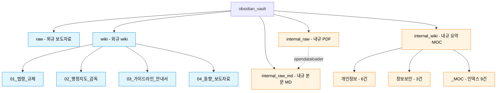

# Obsidian Vault — 규제 추적 시스템

> 회사 내규 + 외부 규제(외규) + 영향도 분석을 Obsidian 형식으로 관리하는 vault입니다.
> 본 README는 **새 팀원이 폴더 구조와 데이터 흐름을 빠르게 이해**하도록 작성되었습니다.

---

## 1. 폴더 구조

### ASCII 트리

```
obsidian_vault/
├── README.md                     ← 이 파일
│
├── raw/                          (다른 팀원) 외규 보도자료 raw .md
│   └── fsec_YYYYMMDD_*.md           — 금융보안원 보도자료 100+건
│
├── wiki/                         (다른 팀원) 외규 정리 wiki .md (4 카테고리)
│   ├── 01_법령_규제/                — 법·시행령·고시
│   ├── 02_행정지도_감독/             — 감독행정
│   ├── 03_가이드라인_안내서/          — 가이드라인
│   └── 04_동향_보도자료/             — 보도자료
│
├── internal_raw/                 (우리) 내규 갈음 원본 PDF/HWP (14건)
│   ├── SOURCES.md                   — 출처·URL·다운로드 방법
│   ├── _download.py                 — Playwright 자동 다운로드 스크립트
│   ├── *.pdf                        — 금융위/금감원/PIPC/FSEC/KB 등
│   └── *.hwp
│
├── internal_raw_md/              (우리) 내규 본문 마크다운 (9건) ⭐ Option C
│   └── *.md                         — opendataloader-pdf 추출 (조항·헤더·표 보존)
│                                       LLM·벡터 임베딩·검색용
│
└── internal_wiki/                (우리) 내규 요약·메타·MOC (9건 + MOC 9건)
    ├── _convert.py                  — PDF→raw_md→wiki 변환 스크립트
    ├── _MOC/                        — 영역별 인덱스 (Map of Content)
    │   ├── README.md                   — MOC 자동 갱신 개발 계약 문서
    │   └── MOC_{영역}.md               — 9건 (수집동의·처리위탁·안전성조치 등)
    ├── 개인정보/                     — 6건 (요약+링크, 1.8-2.1KB)
    └── 정보보안/                     — 3건 (요약+링크, 1.8-2.1KB)
```

### Option C: 3단 분리 정책

내규 자료는 **사용 목적별로 3단계** 분리:

| 폴더 | 용도 | 보는 사람 |
|---|---|---|
| `internal_raw/` | 원본 PDF (인용·정확성) | 정확한 원문 확인 |
| `internal_raw_md/` | 본문 전체 마크다운 | LLM·벡터 DB·검색 |
| `internal_wiki/` | 요약·메타·MOC 연결 | 사람이 일상 작업 (Obsidian Graph) |

→ wiki MD는 ~2KB 내외로 깔끔, 본문 전체는 raw_md에서 검색·인용, 원본은 raw에서 보장.

### 머메이드 다이어그램 (지원하는 프리뷰에서)



| 색 | 의미 |
|---|---|
| 파랑 | 다른 팀원 작업 (외규 영역) |
| 주황 | 우리 작업 (내규 영역) |

---

## 2. 폴더별 책임

### 외규 영역 (기존 팀원 작업)

| 폴더 | 내용 | 발행처 예시 |
|---|---|---|
| `raw/` | 크롤된 보도자료 raw 텍스트 (.md 형식) | 금융보안원(FSEC) |
| `wiki/01_법령_규제/` | 법·시행령·고시 등 강제규범 | 개인정보 보호법, 시행령 |
| `wiki/02_행정지도_감독/` | 행정지도·감독 통보 | 금감원 감독행정 |
| `wiki/03_가이드라인_안내서/` | 비강제 가이드라인 | 가명정보 처리 가이드라인 |
| `wiki/04_동향_보도자료/` | 보도자료·동향 | 위원회 보도자료 |

**작성 형식** — frontmatter 5필드 + 본문 3섹션 (핵심 요약 / 주요 통제 및 규제 사항 / 실무 대응 방향)

### 내규 영역 (이번 cycle 작업)

| 폴더 | 내용 | 비고 |
|---|---|---|
| `internal_raw/` | 내규 갈음 원천 PDF/HWP | 실 내규 반출 불가로 공개 자료 갈음 |
| `internal_wiki/개인정보/` | 개인정보 영역 내규 wiki (6건) | 처리방침·안전성·위탁·신용정보 |
| `internal_wiki/정보보안/` | 정보보안 영역 내규 wiki (3건) | 전자금융·클라우드·망분리 |
| `internal_wiki/_MOC/` | 영역별 인덱스 (Map of Content) | Graph view 허브 노드 |

**작성 형식** — frontmatter (팀원 컨벤션 5필드 + 내규 추가 9필드) + 본문 4섹션 (개요 / 본문 / 관련 외규 / 변경 이력)

### 자동화 스크립트

| 파일 | 역할 | 사용 |
|---|---|---|
| `internal_raw/_download.py` | JS 동적 페이지 PDF 자동 다운로드 (Playwright) | law.go.kr, PIPC, FSEC, KB은행 |
| `internal_raw/SOURCES.md` | 14건 원천 자료의 출처·URL 정리 | 신규 자료 추가 시 항목 추가 |
| `internal_wiki/_convert.py` | PDF → wiki MD 변환 | 신규 raw 추가 시 재실행 |

---

## 3. 데이터 흐름

### 텍스트 흐름도

```
[발행처]                  [raw]                 [wiki]              [인덱스]
                          
금융위 (FSC)      ──curl──> internal_raw/  ──>  internal_wiki/  ──> _MOC/
금융보안원 (FSEC)                                                    │
개인정보위 (PIPC) ─Playwright>                                       v
국가법령정보센터                                                    Obsidian Graph
KB은행                                                              (백링크·tag 기반)
                                                
외부 보도자료     ──크롤──> raw/             ──>  wiki/ (4 카테고리)
```

### 머메이드 (지원하는 프리뷰에서)


---

## 4. 외규 ↔ 내규 연결 메커니즘

```
외규 (wiki/)                                              내규 (internal_wiki/)
─────────────                                            ────────────────────
새 외규 발표           sub_area 태그 매칭                  관련 내규 자동 매칭
"개인정보위 가이드"     ───────────────────>               [[금융분야_개인정보보호_가이드라인]]
                       #영역/수집동의                       [[KB은행_개인정보처리방침]]
                       #영역/처리위탁                       [[개인정보안전성확보조치기준]]

                                  │
                                  v

                       MOC 허브 노드
                       MOC_수집동의.md      <─── 내규/외규 둘 다 여기에 연결
                       MOC_처리위탁.md           Graph view에서 시각적 클러스터
```

**연결 메커니즘**

1. 외규/내규 둘 다 `sub_area` (수집동의·처리위탁·안전성조치 등) 태그를 가짐
2. 같은 태그를 가진 노드끼리 MOC을 통해 묶임
3. 신규 외규가 매칭되면 내규의 `related_external` 배열에 자동 wikilink 추가
4. Obsidian Graph view에서 시각적으로 클러스터 표시

---

## 5. 새 팀원이 알아야 할 핵심

### 자료를 보고 싶을 때

| 목적 | 어디로 |
|---|---|
| 회사 내규 갈음 원천 자료 찾기 | `internal_raw/SOURCES.md` |
| 영역별 관련 자료 묶음 보기 | `internal_wiki/_MOC/MOC_*.md` |
| 외규 종류별 분류 | `wiki/01_법령_규제/` 등 4 카테고리 |
| 외규 raw 텍스트 | `raw/fsec_YYYYMMDD_*.md` |

### 자료 추가·갱신 시

| 작업 | 방법 |
|---|---|
| 신규 외규 자료 추가 (정적 URL) | `internal_raw/SOURCES.md`에 항목 추가 + curl로 다운 |
| 신규 외규 자료 추가 (JS 동적) | `_download.py`에 작업 추가 + 실행 |
| raw → wiki 재변환 | `internal_wiki/_convert.py`에 spec 추가 + 실행 |

### 작성 형식 (frontmatter)

**외규 (wiki/)** — 팀원 컨벤션:

```yaml
---
title: "..."
date: YYYY-MM-DD
source_institution: "기관명"
document_type: "법령 | 감독행정 | 안내서"
tags: [tag1, tag2]
status: "현행 | 폐지"
---
```

**내규 (internal_wiki/)** — 위 5필드 + 내규 추가 필드:

```yaml
---
title: "..."
date: YYYY-MM-DD
source_institution: "..."
document_type: "사내규정-갈음"
tags: [...]
status: "active | needs-review | archived"

type: "사내규정"
version: "v1.0"
effective_date: YYYY-MM-DD
last_updated: YYYY-MM-DD
sub_area: [수집동의, 처리위탁, ...]
source_doc: "raw 파일명"
source_url: "원천 URL"
substitution_note: "갈음 사유"
related_external: []
---
```

---

## 6. 자동화 스크립트 실행법

```bash
# 1회 환경 셋업
python3 -m venv /tmp/playwright-venv
/tmp/playwright-venv/bin/pip install playwright pypdf opendataloader-pdf
/tmp/playwright-venv/bin/playwright install chromium

# 동적 페이지 raw 다운로드 (5건)
/tmp/playwright-venv/bin/python obsidian_vault/internal_raw/_download.py

# raw → wiki 변환 (9건 + MOC 9건)
/tmp/playwright-venv/bin/python obsidian_vault/internal_wiki/_convert.py
```

> opendataloader-pdf는 Java 21+ 필요 (`brew install openjdk@21`)

---

## 7. 향후 작업 (TBD)

- [ ] 외규 raw → wiki 자동화 LLM 파이프라인 (현재 수동)
- [ ] 신규 외규 들어올 때 내규 `related_external` 자동 갱신
- [ ] 영역별 MOC에 영향도 분석 결과 자동 누적
- [ ] 일부개정 고시만 받은 자료 (전자금융·신용정보) → 통합본으로 보강
- [ ] 본문 추출 도구 업그레이드 (pypdf → opendataloader-pdf)
